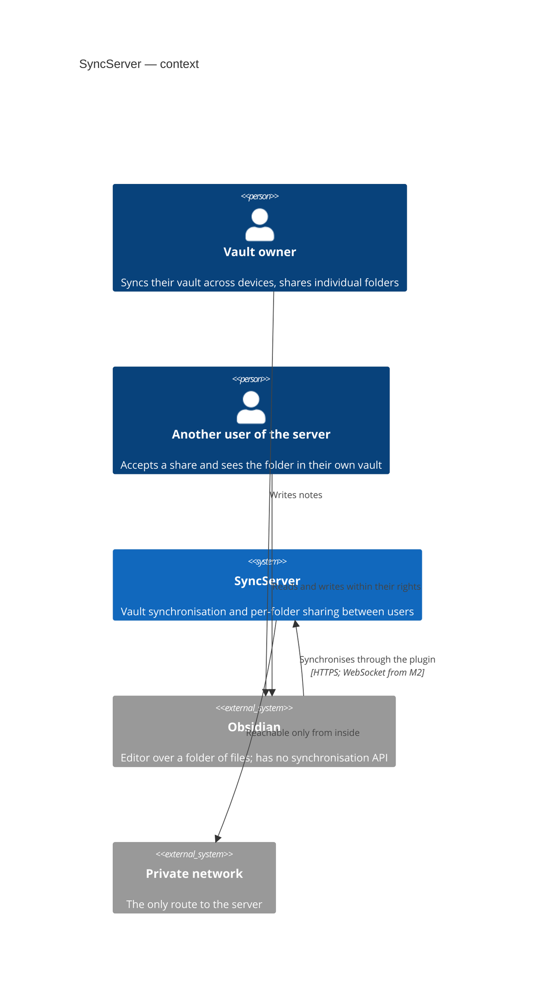
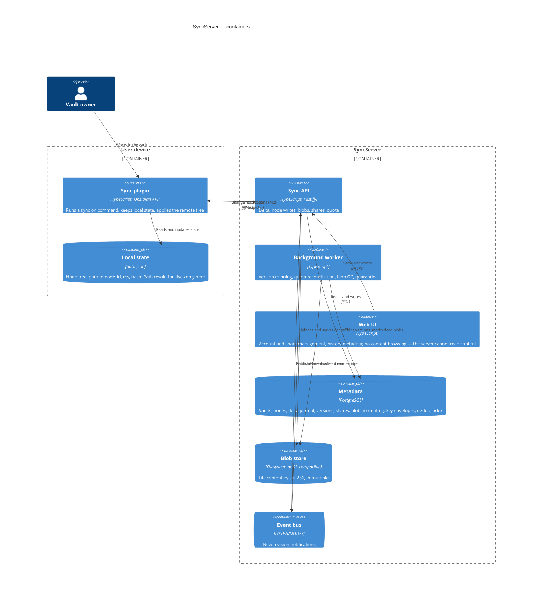
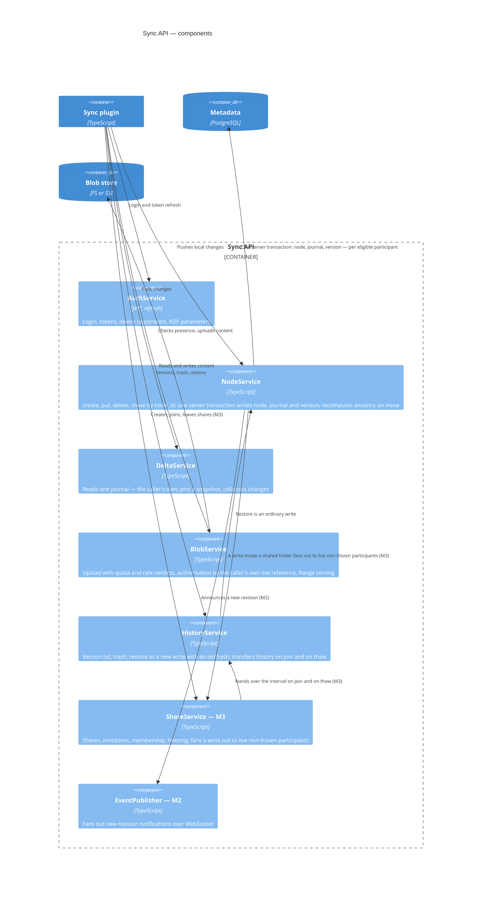
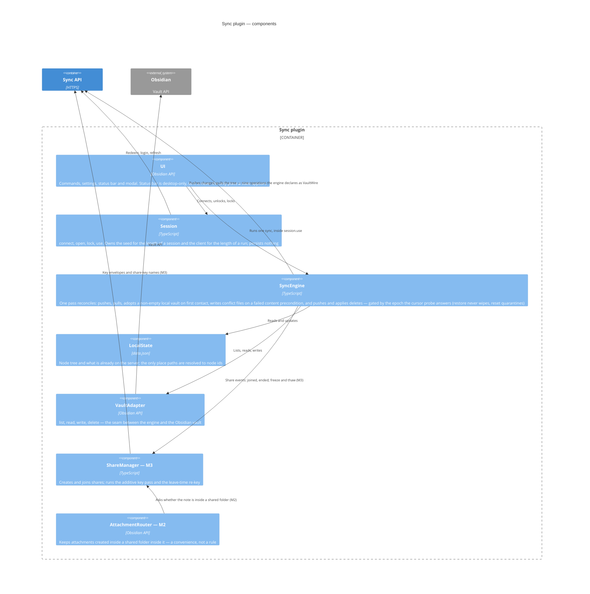
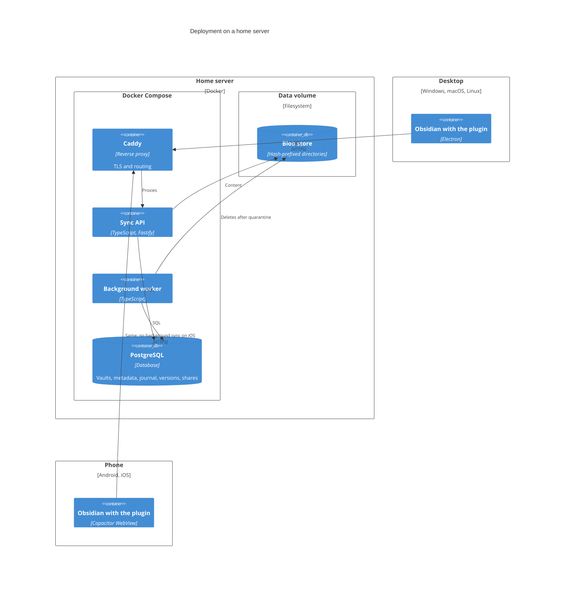

# 02 — Architecture

## Context (C4 level 1)

Obsidian is an **external** system. It knows nothing about synchronisation, which is why the plugin
exists and why the system is in two parts.

## Containers (C4 level 2)

Two things are worth reading from this level.

**Content and metadata are separate stores.** Everything that makes the system cheap — deduplication,
free renames, history, blobs shared between vaults through a share — rests on that split.

**The worker is separate from the API.** Version thinning and garbage collection must run as one nightly
pass in a specific order (see [03](03-data-model.md)); tying them to user requests would make that order
impossible to guarantee.

Cryptography is almost invisible on these diagrams, and that is the point: the keys live on the clients,
the server stores envelopes and never opens them.

## Sync API components (C4 level 3)

`NodeService` is the only place a revision is born, which is why the three-way transaction converges on it.
A second write path bypassing it would desynchronise history from delta. For a shared write, the service
command owns the complete cross-vault transaction and its integration test; database triggers protect
row-local invariants but do not by themselves prove all-or-none fan-out.

**`ShareService` does not stand between a reader and someone else's data.** A participant reads their own
nodes, so nothing is evaluated at read time at all: the service's whole job is on the **write** path, where
one node write becomes up to eight ([05](05-sharing.md)).

Quota is not a component: the verdict an upload needs is computed inside `BlobService` (`mayAccept`), and
the accounting itself is schema counters — there is no separate service to place on this diagram.

## Plugin components (C4 level 3)

**A shared folder is an ordinary folder to every component above `ShareManager`.** That component handles
joining and leaving plus the two key passes described in [06](06-key-model.md); nothing else on the client
needs to know that a folder is shared. There is no read-only state to emulate (SH-10), nothing to mount, and
no detachment protocol for the client to drive — a participant's copy is their own from the start.

There is no watcher: sync is a command the user runs, and the engine's one pass is the whole reconciliation.
Adoption and conflict resolution are not components of their own — they are branches of that pass, and the
diagram above names no module the code does not have. `Session` is the one the M0.5 code grew into: it owns
the lifecycle `main.ts` used to hold in pieces, and it is what makes the passphrase-to-keys wiring testable
without launching an editor.

## Deployment

**The server is not published externally.** Access is from inside a private perimeter only, until
authentication has had a review of its own. That is a deployment constraint rather than an architectural
one — but while it holds, it is the boundary of the system.

## Deliberately absent

Named so that their absence reads as a decision rather than an omission:

- **the code level of C4** — there is no code yet, and describing classes in advance is fiction;
- **a WebDAV gateway** — a roadmap item (M5), not part of the system today;
- **a separate search service** — search stays in Obsidian, on the client. Server-side search is impossible
  under E2EE (the server cannot read content) and is not planned;
- **a cache or CDN in front of the blobs** — premature at the scale of a handful of people.

## Client constraints

The plugin ships as **one JavaScript bundle that runs both in Electron and in a Capacitor WebView**, which
rules out Node APIs and native dependencies. Practical consequences:

- no `fs`, no native image libraries — vault access goes through the Obsidian API;
- `manifest.json` must set `isDesktopOnly: false`;
- files are processed sequentially — mobile memory limits are real;
- iOS has no background synchronisation: sync happens when the app is open;
- **the status bar does not render on mobile.** It may carry a state, never alone.

Two further constraints shape the protocol rather than the code, and they are the reason for the section
below:

- **a plugin instance can only reach the vault it runs in.** Plugins are installed per vault, the API
  exposes that vault and no other, and switching vaults restarts the application. Anything the design asks
  a client to do "in another vault" is unimplementable;
- **the plugin exists only while the application is open.** There is no background execution to fall back
  on, so the server can never depend on a timely answer from a person.

## Talking to the user: states, not questions

The server does not ask questions. It holds **states**, and the client displays them; a question is only
posed when the user has already started the operation that needs it, and only for something the client
cannot observe on its own.

This is not a UI preference. A question needs an answer, an answer needs the application open on a
particular device, and there is no guarantee either ever happens. Anything built on a reply that may never
arrive stalls silently.

| Signal | Not this | This |
|---|---|---|
| over quota (SH-20) | a message to acknowledge | a state: sync stops, the panel says what is wrong. There is no decision to make — the way out is deleting something, which is ordinary vault editing |
| a share invitation | a dialog that interrupts | a list the user opens when they choose (`GET /shares`). Declining deletes it and frees the slot; ignoring it leaves it in the list |
| somebody joined, declined, or left | a push to the initiator | the membership list (`GET /shares/{id}/members`). The plugin diffs it against its own copy and writes a line in its log — the fact lives in the list, not in a message that can be missed |
| revocation, share ended | a notification | a state: the folder quietly becomes ordinary content; the event appears in the plugin's log |
| leave/revoke finalization (SH-29) | a task the user performs | a background metadata pass. It waits for the device to be opened, and blocks nobody while it waits |
| a conflict | a prompt to resolve | a file plus an entry in the conflict list — the pattern the rest of this table follows |
| which vault a share lands in | a choice to answer | **observed, not asked**: it is the vault the accepting client runs in (AC-Q4). This is the constraint above turned into a simplification — the question could not have been honoured anyway |
| `410 reset` on another device | — | **a real dialog, and the only one required by the server.** Deletions are about to be applied; the cost of guessing wrong is data ([07](07-onboarding.md)) |

Two dialogs remain in the whole design, and both open inside an action the user just started: choosing where
a replica root goes and what it is called, and confirming a reset on a second device.
