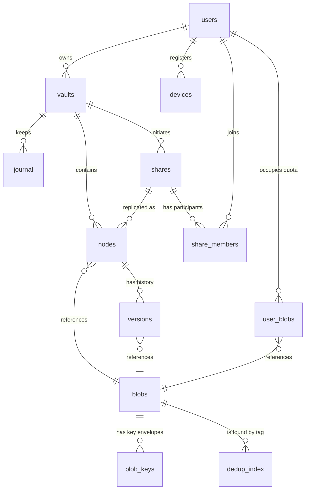

# 03 — Data model

Normative reference for `db/schema.sql`. Where this document and the schema disagree, one of them is a
bug: fix both.

## Three structural decisions

**An account holds many vaults (AC-10).** `users` is the **account**: it carries
authentication, role, state and the **quota** (per account, `AC-Q2`). A `vaults` row is a distinct sync
unit under it, carrying `head_rev`, `reset_epoch`, its tree root and its key id; every `nodes`, `journal`
and `versions` row belongs to a vault. A successful login lists the account's vaults and its
quota-with-remaining; sync then runs against one chosen vault. Which vaults a device syncs is a client
choice — vaults are **not** bound to devices (AC-13), so there is no `device × vault` table.

**A node is keyed by `(vault_id, id)`, not by path (#29).** The server never assembles a path and never
sees a name. The tree is `parent_id` links plus a **ciphertext** name stored beside them. This is forced,
not aesthetic: a server that cannot see names cannot key by them. It also pays for itself — `move` no
longer changes the key, so history survives a rename with no cascades at all.

**Everything is E2EE; there is no server-readable mode (AC-08).** The server stores
only ciphertext and reads neither content nor names. There is no `enc_mode` column and no plaintext `name`;
a node carries `name_enc` and a keyed `name_hmac` the client computes. What the server still sees — sizes,
tree shape, timestamps, version counts — is **deliberately not hidden**; only content and names are.

## Entities



| Table | Key columns | Purpose and notes |
|---|---|---|
| `server_meta` | `only_row` (PK, always true), `restore_epoch`, `restored_at` | one row per server. `restore_epoch` travels inside the delta cursor; a trigger forbids it from decreasing. The server also mirrors the epoch into a state file outside every dump, so an unconfirmed restore is detected at startup (#92) |
| `users` | `id`, `login`, `auth_secret_hash`, `account_salt`, `kdf_params`, `wrapped_seed`, `pubkey`, `enc_privkey`, `kek_verifier_hash`, `recovery_key`, `recovery_code_hash`, `role`, `state`, `invite_token_hash`, `invite_expires_at`, `quota_bytes`, `frozen_at` | the **account** — authentication and quota, not a vault (AC-10). `wrapped_seed` is the account master secret sealed under the passphrase-derived KEK (AC-11) — every vault key branches off it, and the server never sees the seed itself. `frozen_at` is the over-quota state (SH-20), and it lives here because the quota does: a freeze covers **every** vault the account owns and every share it participates in, at once. **`auth_secret_hash`, never `pwd_hash`**: the passphrase does not reach the server; `auth_secret = HKDF(seed, "auth")`. It, `recovery_code_hash` and `invite_token_hash` are **SHA-256 hex, constant-time compared** (#108) — their inputs are ≥128-bit CSPRNG output, so a slow KDF would only cost latency on every login. `kek_verifier_hash` is stored the same way for the opposite reason (#112): its input descends from the passphrase, and the slow KDF guarding it has already run on the client. The two verifiers guard the two seed envelopes a device with nothing can ask for — `kek_verifier_hash` guards `wrapped_seed`, `recovery_code_hash` guards `recovery_key` — and in both cases the caller proves it can open the envelope before receiving it. **The recovery pair is nullable and null by default**: an account with no recovery code says so, rather than carrying a placeholder that claims a path it does not have. Pairing and recovery both return encrypted `enc_privkey` with seed bootstrap material, so a new device restores the account identity as well as vault keys. `quota_bytes` is **per account**, summed across the owner's vaults (AC-Q2). `state` and the key columns are tied by a `CHECK` with three shapes (#83): an invitation carries a token and no keys, the **tombstone** carries nothing at all, and anything else carries the full set. The tombstone is the one reserved row — `state = 'tombstone'`, unique, the identity account deletion reassigns authorship to (#55). Nobody can log into it, it owns nothing, and it is neither deleted nor changed once it exists. `kdf_params` is validated — JSON fields `v`, `m`, `t`, `p`, numeric and never below the floor — because a new device reproduces the KEK and unwraps the seed from those parameters. Nothing vault-shaped lives here: `vault_key_id`, `head_rev` and `reset_epoch` belong to `vaults` |
| `vaults` | `id`, `user_id`, `name_enc`, `root_node_id`, `vault_key_id`, `head_rev`, `reset_epoch`, `created_at` | a sync unit under an account (AC-10). `head_rev` is this vault's own cursor position; `reset_epoch` bumps on a **per-vault** reset (AC-14). `vault_key_id` names the scope key `blob_keys.scope_id` points at for own content, with `KV = HKDF(seed, id)` (AC-11) — so two vaults of one account never dedup against each other (AC-09). The client supplies the UUID **before** deriving `KV` and encrypting `name_enc`, then sends both at redeem or create; a login lists vaults by `(id, name_enc)`, and the client derives `KV` from the `id` to read the label. `root_node_id` caches the one node whose `parent_id IS NULL` in this vault. Rename changes only `name_enc`; delete is allowed only after the vault has no non-root nodes **and nothing still names it** — the FKs from `shares.initiator_vault_id` and `share_members.vault_id` block it, and an *ended* share keeps its row until the collector takes it after the journal TTL, so a vault that hosted a share stays undeletable for up to 90 days after it ends ([04](04-sync-protocol.md)) |
| `devices` | `id`, `user_id`, `name`, `platform`, `last_seen_at`, `refresh_token_hash`, `revoked_at` | a device belongs to the **account**, not a vault (AC-13): it may reach any of the account's vaults, and which it syncs is a client choice — no `device × vault` table. Cursors are client-owned and per vault, so the device table stores no authoritative cursor (only a diagnostic `last_cursor` the client may sync). One refresh token **per device**, so signing out one device is possible at all (#90); `refresh_token_hash` is SHA-256 hex like the other three verifiers (#108) |
| `device_pairings` | `id`, `device_pubkey`, `pairing_token_hash`, `approved_user_id`, `seed_envelope`, `approved_at`, `claimed_device_id`, `claimed_at`, `expires_at` | short-lived bootstrap relay for a new device. Creation is anonymous and stores only its ephemeral public key plus a hash of the pairing secret. Approval binds exactly one account and its opaque seed envelope; claim is exactly once and creates/binds the device. Neither seed nor pairing secret is stored in plaintext |
| `key_scopes` | `id`, `kind` (`vault` / `share`) | durable registry for every identifier used by `blob_keys` and `dedup_index`. Vault and share rows must point to the matching kind. A share scope survives share deletion while an envelope still references it |
| `audit_log` | `id`, `at`, `actor_user_id`, `actor_login`, `action`, `target_user_id`, `target_login`, `details` | administrative actions on other people's accounts. Neither updatable nor deletable (#87, #94), and **deliberately free of foreign keys** (#93): the logins are snapshots, so the record survives — and keeps naming — an account that is later renamed or deleted |
| `backup_runs` | `id`, `started_at`, `window_opened_at`, `window_closed_at`, `blobs_done_at`, `db_done_at`, `finished_at`, `status`, `bytes`, `blob_count`, `destination`, `error`, `verified_at`, `triggered_by` | backup history. A run records the **refusal window** and both legs, and `CHECK`s reject any run whose leg falls outside it — or whose blob leg finished without the database leg preceding it (#114) — so both the window and its **order** are enforced rather than described. `window_opened_at`/`window_closed_at`, never `frozen`: this server refuses *new* writes and cannot stop running ones, and `freeze` is the quota state (SH-20). A `failed` run must carry its reason; `verified_at` is the last successful restore drill |
| `nodes` | `id`, `vault_id`, `parent_id`, `name_enc`, `name_hmac`, `name_key_id`, `type`, `sha256`, `size`, `mtime`, `rev`, `deleted_at`, `ancestry`, `share_id`, `share_item_id` | the vault tree, keyed by `(vault_id, id)`. **No plaintext `name`** (AC-08): a node carries `name_enc` and a keyed `name_hmac` the client computes. Private nodes and each replica **root** use their vault key `KV`; the strict descendants of an active shared root use its `KS`. Root labels/locations are local metadata, never propagated. `ancestry` is the materialised chain of **strict** ancestors, root first, own id excluded — subtree queries are tests against it. Soft delete: the row *is* the trash entry. `share_id` + `share_item_id` mark a node as part of a replica and give it the **share-scoped identity** that is the same in every participant's copy: it is how a write finds its counterparts, and how version rows are attached in a vault that has never seen them (SH-21, SH-23) |
| `blobs` | `sha256` (PK), `size`, `storage_key`, `enc_alg`, `key_id`, `refcount`, `gc_marked_at` | immutable content, addressed by the hash of **what is stored** — always header‖ciphertext, because there is no plaintext mode (AC-08), so `enc_alg`/`key_id` are never null |
| `blob_keys` | PK `(sha256, scope_id)`, `wrapped_key` | the content key, wrapped once per scope (a vault key or a share key) allowed to read it. This table is what makes sharing an existing folder a metadata operation |
| `dedup_index` | PK `(scope_id, content_tag)`, `sha256` | deduplication: content keys are random, so identical content needs an index to converge. Scoped by `scope_id`, so two vaults of one account do not dedup against each other (AC-09). Only a holder of the scope key can compute the tag |
| `user_blobs` | PK `(user_id, sha256)`, `refs_own`, `refs_pending`, `pending_since`, `pending_device_id` | quota accounting, **per account across all its vaults**: the complete set of blobs the account holds. Quota = `SUM(size)` over these rows, and nowhere else (AC-Q2). Because keys are per vault, the same file in two vaults is two blobs counted twice (AC-09). `pending_device_id` attributes an unbound upload for the sweep. **There is no share counter** — a replica is own content, charged through `refs_own` like anything else (SH-03) |
| `journal` | PK `(vault_id, rev)`, `node_id`, `prev_parent_id`, `op`, `node_rev`, `at` | the **delta log**, 90-day TTL. Append-only. One per **vault** (AC-12): a propagated write appends to the journal of whichever vault holds each participant's replica, so nobody ever reads someone else's |
| `versions` | PK `(vault_id, node_id, rev)`, `sha256`, `size`, `at`, `author_id` | **history**, with its own retention policy. Keyed by the full node identity and revision, so a rename does not touch it. `author_id` is the **original writer**, which in a share is routinely another account (SH-19) — that is what makes account deletion a procedure rather than a query, now across up to eight vaults. It is `NOT NULL` with `ON DELETE RESTRICT`, so a deleted account's rows are **reassigned to the tombstone**, never nulled: "written by somebody who has left" is a different fact from "written by nobody" |
| `shares` | `id`, `initiator_id`, `initiator_vault_id`, `subtree_node_id`, `root_item_id`, `state`, `subtree_key_id`, `wrapped_key_initiator`, `created_at`, `terminal_at` | a share is a folder of one of the initiator's vaults plus participants. `(initiator_vault_id, subtree_node_id)` is the **initiator's** node for that folder — a full node key, since ids are per vault now; every other participant's copy is found through `nodes.share_id` + `share_item_id`. Its state machine is `preparing → active → ended` or `preparing → cancelled`; terminal states share one `terminal_at` timestamp and never reopen. `preparing` is an additive, resumable metadata pass that blocks only invite/join. No mode or role (SH-10), no assets policy (SH-26), no sequence counter, no preparation lease, and **no key epoch** — the share key is never rotated (#10), so there is no generation to name |
| `share_members` | PK `(share_id, user_id)`, `vault_id`, `invited_at`, `joined_at`, `finalization_started_at`, `left_at`, `wrapped_key` | one row per participant, the initiator included. `vault_id` is the vault the participant **accepted in**, where their replica lives (AC-Q4) — set when they join, from the vault their client is running in rather than from an answer they had to give. `finalization_started_at` stops propagation immediately while that member's client converts its copy to private KV metadata; `left_at` means the conversion committed. **No freeze column and no key epoch**: over quota is an account state (`users.frozen_at`), and the share key is never rotated |

## What the schema seeds

Three rows exist from the moment `schema.sql` runs, because nothing else could ever create them (#107):

| Row | Why it cannot be created later |
|---|---|
| `server_meta` | one row per server, and the epoch it carries must exist before the first cursor is issued |
| the **tombstone** — `users`, nil UUID, `state = 'tombstone'`, login `deleted` | account deletion reassigns authorship to it (#55), so it has to predate the first deletion. Seeding is also what **reserves** the login: `users_login_key` is unique, so no real account can take `deleted` afterwards |
| the **first administrator** — `users`, `role = 'admin'`, `state = 'provisioned'`, login `admin`, **no password and no keys** | every account is born from an invitation an administrator issues (#83), so the first one has nobody to invite it. It is a **console** account (#115), so there are no keys to be born on a device either — what it is missing is a password, and that is the one thing a person can supply without a client |

That row carries **no credential at all** — `password_hash` is null, and `keys_match_state` has an arm for
exactly this shape. `POST /auth/bootstrap` **creates** the password rather than replacing a known one, which
is the property a seeded default cannot have: a default keeps working for anybody who never got round to
changing it. The statement that sets the password is the same one that moves the row out of `provisioned`,
so it succeeds once and answers `409` from then on, and the application refuses to serve anything else until
it happens ([04](04-sync-protocol.md)) — the window is the first run rather than for ever (#107).

## Invariants

1. `nodes.rev` equals the `rev` of the last `journal` entry for that node, in that node's vault — **for as
   long as that entry survives**. The journal has a 90-day TTL, so a node nobody has touched since then has
   no entry left and the equality has nothing to compare against. This is why the schema checks only that a
   node's `rev` never exceeds its vault's `head_rev` (`nodes_revision_within_vault_head`) and never demands
   a contiguous journal: the writer allocates revisions and prunes expired rows, so contiguity is not a
   property the database can hold.
2. `vaults.head_rev` is the maximum journal `rev` for that **vault** (AC-12), **for as long as the newest
   journal row survives** — the same 90-day TTL that bounds invariant 1. After the last entry is pruned the
   journal holds nothing and `head_rev` is the largest `rev` ever allocated, not the maximum of a surviving
   set. Both are updated **in the same transaction** as the node write.
3. A blob's **identity** is never updated — `sha256`, `size`, `storage_key`, `enc_alg`, `key_id` are fixed
   at creation and enforced by a trigger, because the address *is* the content. Only `refcount` and
   `gc_marked_at` change, and those belong to the collector rather than to the blob.
4. Every `put` appends to **both** `journal` and `versions`, in the same server transaction as the node write and
   its client-produced envelope/tag material. All of it commits, or none does.
5. **Each vault has exactly one root node with no name**: `parent_id IS NULL`, the name column empty. The
   "a node must have a name" rule exempts it — otherwise the root cannot be inserted at all. Root
   uniqueness is per `vault_id`.
6. A node row for a deleted file is **not** removed: a client with an old cursor must still see the
   deletion, and the user must be able to restore the file. The row lives as long as one of its versions
   does.
7. Names, not paths, are normalised: no separator, no traversal, NFC. The hash input is always
   `casefold(NFC(name))`. **The system reserves no name of its own** — nothing is set aside for internal
   use. Platform-forbidden names (`CON`, `NUL`, `COM1`…) are a separate matter and are still refused; see
   *Names* below.
7a. `ancestry` holds the **strict** ancestors of a node, root first, and **not** the node's own id:
   `ancestry = parent.ancestry ‖ parent_id`, so the vault root carries `{}`. The two derived forms are
   therefore different, and the difference is an authorisation boundary, not a detail:
   *strictly under X* is `ancestry @> ARRAY[X]`; *X itself or anything under it* is
   `id = X OR ancestry @> ARRAY[X]`. A `move` rewrites the array for the **whole** subtree in the same
   transaction; a deferred constraint trigger refuses the commit if it did not.
8. `user_blobs.refs_own` changes in the same transaction as the reference that caused it. No part of the
   accounting is deferred: a replica is own content, so a shared folder is counted the same way a private
   one is.
9. A write inside an **active** shared folder is applied by one server command/transaction to the writer's
   node and to corresponding nodes of the live non-frozen participant set: `joined_at` set,
   `finalization_started_at` and `left_at` unset, and the member's **account** not frozen
   (`users.frozen_at IS NULL`, SH-11, SH-20). Each is an ordinary node write
   in the vault that participant accepted in: it bumps **that vault's** `head_rev`, appends to **that vault's**
   `journal` and appends a `versions` row whose `author_id` is the **original writer**, not the receiving
   account. This cross-vault all-or-none property is an API/service contract requiring an integration test;
   it is not guaranteed by database triggers alone.
10. A blob is addressed by the hash of what is actually stored. The content key and nonce are **random**, so
    the same file encrypted twice yields two addresses; convergence is `dedup_index`'s job, not the
     addressing's. There is no plaintext form to address (AC-08).
11. A private node and a share-root node's `name_key_id` equal their vault's `vault_key_id`. The strict
    descendants of an **active** share root have `name_key_id = shares.subtree_key_id`. During `preparing`,
    interior nodes may be mixed while the pass converts them; activation validates that no `KV`-named interior
    node remains.

## What the schema enforces

The triggers enforce local database rules no matter which code path violates them. Several
(`nodes_no_cycles`, `nodes_type_immutable`) exist only here and are not discussed at length elsewhere —
that is the point of listing them, and the point of the list being **complete**: every trigger in
`db/schema.sql` appears below, under the name it actually has, and each is fired from the wrong side by
`db/tests.sql`. Eleven are `CONSTRAINT TRIGGER`s that fire at commit; they are marked **deferred**.

### Tree and vault structure

| Trigger | Rule | Decision |
|---|---|---|
| `nodes_no_cycles` | a node may not be moved under its own descendant | — |
| `nodes_type_immutable` | a file never becomes a folder and a folder never becomes a file | #102 |
| `nodes_ancestry_matches_parents` | `ancestry` matches the parent chain, and no descendant is left behind by a `move`. **Deferred**: the rewrite may pass through inconsistent states, the commit may not | #29, #98 |
| `nodes_name_is_encrypted` | a non-root node carries `name_enc` and a keyed `name_hmac`; `name_key_id` matches its vault `KV` when private or a share root, and its share `KS` for active interior nodes; there is no plaintext name | AC-08, SH-28 |
| `vaults_root_is_exactly_one_node` | a vault has exactly one node with no parent, and `root_node_id` names it. **Deferred**: a transaction may create the vault before its root | #29 |
| `nodes_keep_vault_root_linked` | the root a vault points at cannot be re-parented or removed out from under it. **Deferred** | #29 |
| `vaults_delete_requires_explicit_cleanup` | a vault is deleted only after its contents are cleaned up; a cascade here would erase a whole sync unit, history included, on one mistaken `DELETE` | AC-10 |

`share_id`/`share_item_id` travel together as a plain `CHECK` (`share_pair_travels_together`), and
`(share_id, share_item_id, vault_id)` is unique through an index rather than a trigger — one node per replica
per shared item, and a member holds their replica in exactly one vault, the one they accepted in (SH-02,
AC-Q4).

### Revisions and epochs

| Trigger | Rule | Decision |
|---|---|---|
| `vaults_revision_bounds` | `head_rev` may not fall below what the vault's own rows already claim. **Deferred** — the writer allocates revisions, so the schema cannot demand a contiguous journal, only reject impossible bounds | AC-12 |
| `nodes_revision_within_vault_head` | a node's `rev` never exceeds its vault's `head_rev`. **Deferred** | AC-12 |
| `journal_revision_within_vault_head` | a journal row's `rev` never exceeds its vault's `head_rev`. **Deferred** | AC-12 |
| `versions_revision_within_node` | a version's `rev` never exceeds its node's. **Deferred** | #14 |
| `vaults_reset_epoch_forward`, `server_meta_epoch_forward` | an epoch may only increase (per vault / server-wide) | #79 |
| `server_meta_is_not_replaceable` | the single server row cannot be deleted or duplicated | #69 |

### Key material

| Trigger | Rule | Decision |
|---|---|---|
| `nodes_private_writes_have_key_material` | a private node's blob carries its `KV` envelope and dedup tag in the same transaction as the reference | #38, #64 |
| `nodes_active_share_writes_have_key_material` | a write inside an active share carries the `KS` envelope and tag too | #45, SH-28 |
| `versions_active_share_writes_have_key_material` | so does a version row — history left under one scope alone is history nobody else can open | #45, SH-23 |
| `shares_activation_has_all_key_material` | `activate` succeeds only when every current **interior** shared node is named under `KS`, every blob reachable from nodes or versions has its `KS` **envelope**, and every live head has its `KS` **tag** | SH-28 |
| `shares_keys_match_state` | an active share carries a subtree key and the initiator's envelope; the pairing is not enough, both must be present | #39, #50 |
| `nodes_unmark_requires_finalization_material` | an unmark is allowed only during that member's finalization, after every affected node is named under `KV`, each current/history blob has its `KV` **envelope**, and a live head also has its `KV` **tag** | SH-05, SH-22, SH-29 |

The envelope/tag split is deliberate and holds in both directions. The **envelope** keeps bytes
openable, and re-wrapping a content key needs no plaintext — so it is owed for every blob a node
still points at, history included. The **tag** is an HMAC over the plaintext, which exists on disk
only for a live head; demanding one for history or for the trash would ask a device to download and
decrypt every superseded version to compute a value nothing will ever look up, since deduplication
answers "have I uploaded this before".

### Sharing structure

| Trigger | Rule | Decision |
|---|---|---|
| `shares_root_is_a_live_folder` | a share is rooted at a live **folder** of the initiator's own vault, and there is no nesting: not inside a replica, and not over an ancestor of one | SH-01, SH-18 |
| `shares_root_carries_its_marks` | the folder a share names carries that share's id and its `root_item_id`. **Deferred** | #105 |
| `shares_initiator_is_immutable` | neither the initiator nor their vault can be swapped afterwards — ownership never changes hands | SH-24 |
| `shares_state_moves_forward` | `preparing → active \| cancelled`, `active → ended`; terminal states never reopen | SH-17 |
| `shares_no_delete_while_live` | a live share is ended, not deleted | #44 |
| `shares_ended_leaves_nobody` | an `ended` share has no participant with `left_at IS NULL`. **Deferred** | SH-07, SH-17 |
| `nodes_share_membership_is_real` | the share mark is checked **both ways**: a marked node is the share's root item or has a parent in the same share, its owner is a live participant, and it sits in the vault that participant accepted in; and a node inside a shared folder is **itself** marked. **Deferred** | #105, AC-Q4, SH-26 |
| `nodes_no_delete_of_share_root` | the root of a live share cannot be soft-deleted; end the share first | SH-17 |
| `nodes_unmark_drops_history` | clearing a share mark leaves an added participant's node with no version rows; the initiator keeps theirs. **Deferred** | SH-22, SH-25 |
| `nodes_frozen_account_sends_nothing` | while an account is frozen, nothing that **grows** usage may be written in any of its vaults, and its replicas do not move at all in either direction. Renames, moves and deletes stay allowed, because deleting is the only way out | SH-20 |

### Membership

| Trigger | Rule | Decision |
|---|---|---|
| `share_members_ceiling` | at most 8 participants, the initiator included. It counts **live rows**, so an outstanding invitation occupies a slot from the moment it is sent — otherwise nine people could accept an eighth place at once | SH-11 |
| `share_members_initiator_stays` | the initiator's row cannot be removed while the share lives; their departure ends it instead | SH-17 |
| `share_members_join_carries_a_key` | four arms on one function: a terminal share regains no live member; **joining** and **inviting** are both allowed only while the share is `active` — not while `preparing`, whose interior names are not yet under `KS`; and joining requires the key envelope, which an outstanding invitation legitimately has none of. The initiator's own row is exempt: it is created with the share, before it can be active | #10, #31, SH-28 |
| `share_members_finalization_moves_forward` | `finalization_started_at` stops propagation before `left_at`; it is immutable until a fresh membership interval | SH-05, SH-16, SH-29 |
| `share_members_leave_clears_marks` | leaving is refused while the participant still holds nodes marked with that share — the replica must stop being one first | SH-05 |
| `share_members_delete_requires_finalization` | a membership row is evidence that finalization completed, so it cannot be deleted before it does. **An unaccepted invitation is exempt**: it never joined, so it can carry neither `finalization_started_at` nor `left_at`, and without the exemption decline and withdrawal would be impossible and the slot would leak | SH-29 |

### Accounts, devices and authorship

| Trigger | Rule | Decision |
|---|---|---|
| `users_last_admin_stays` | the last active administrator cannot be demoted, disabled, put into deletion **or deleted** | #88 |
| `users_delete_follows_the_procedure` | an account that ever held data must pass through state `deleting` before removal; an unclaimed invitation is exempt | #55 |
| `users_active_ownership_is_required` | an account cannot leave the `active` state while it still owns vaults, devices or nodes | #55, #84 |
| `vaults_owner_is_active`, `devices_owner_is_active`, `nodes_owner_is_active` | only an active account owns or writes vaults, devices and nodes | #84 |
| `versions_author_is_active` | authorship is a write by an account that may not own the vault (a share participant), so it needs the same boundary stated separately. It admits **`active` or the tombstone** — a rule that took only `active` would block the anonymisation pass that account deletion depends on (#55) | SH-19 |
| `users_tombstone_is_permanent` | once the tombstone exists it is never deleted, renamed, re-roled or moved to another state. `versions.author_id` points at it with `RESTRICT`, so a delete would fail at a foreign key anyway; this fails with a reason instead | #55 |
| `device_pairings_lifecycle` | a pairing is approved once and claimed once, and neither seed nor pairing secret is ever stored in the clear | #90 |

### Immutability and append-only logs

| Trigger | Rule | Decision |
|---|---|---|
| `blobs_identity_immutable` | `sha256`, `size`, `storage_key`, `enc_alg` and `key_id` never change — the address *is* the content. `refcount` and `gc_marked_at` are outside the rule | #19 |
| `journal_append_only`, `audit_log_append_only` | an `UPDATE` on either log is always a bug | #2, #87 |
| `audit_log_no_delete` | audit rows cannot be deleted either — unlike the delta journal, which is pruned by TTL | #94 |

`db/tests.sql` fires every one of them from the wrong side and asserts **which rule** rejected it — the
expected `SQLSTATE` plus a fragment of the message (#101). The code alone would not do: nearly every
trigger above raises `check_violation`, the same one a plain `CHECK` produces.

Two shapes recur in this area and are worth naming, because a `CHECK` catches neither:

- **a constraint that verifies the *pairing* of two columns without demanding that either be present.** An
  `active` share with no subtree key, or a member whose row pairs a null envelope with a null epoch, passes
  such a check and produces a folder members can list and cannot open. Each of these rules therefore also
  demands presence, from both ends;
- **a check that runs when row A is written, guarding a fact that lives in row B.** The fact can change
  afterwards, so the second end has to be checked too — that is why `nodes.type` is immutable outright
  (#102) and why the share mark is verified from the node *and* from the share (#105).

Testing them has one mechanical consequence: the deferred triggers never fire in a transaction that ends in
`ROLLBACK`, so `db/tests.sql` forces them — see `AGENTS.md`, "Working on the schema and its tests".

## Names

The rules are set by the **strictest platform the vault runs on**, because anything else lets one client
create a state another client can never materialise:

- Unicode NFC — macOS hands out NFD, and without normalisation Cyrillic names silently duplicate;
- no characters Windows refuses (`: ? * " < > |`), no control characters, no trailing dot or space, no
  reserved device names (`CON`, `NUL`, `COM1`…);
- sibling uniqueness is **case-insensitive**, so `Note.md` and `note.md` cannot coexist. A rename that
  only changes case therefore stays a `move` — history survives it.

### `name_hmac`

`name_hmac = HMAC(scope key, casefold(NFC(name)))`, computed by the **client** — the server holds no key and
never sees a name (AC-08). The scope key is the vault key `KV` for own content and the share key `KS` for a
name while it is inside a share, which is why re-keying a name across a scope boundary recomputes its hash.

The keyed form is not optional: an unkeyed hash of a guessable name is a dictionary attack that recovers
filenames, defeating the very point of `name_enc`.

Two consequences the schema must live with:

- **the server cannot verify a name against its hash** — it has neither. Sibling uniqueness is an index over
  the **hash**, so the client is trusted to compute it from the name it encrypted; a client that lies
  corrupts only its own vault's listing, which is its own to repair.
- **every name rule enforced by `is_valid_name()` is a client guarantee**, not a schema one. The server
  cannot reject a forbidden name, a case collision or a bad normalisation, because it cannot read the
  name — the plugin is the only enforcement point.

## Quota accounting

Quota is `SUM(blobs.size)` over the **account's** `user_blobs` rows — one set covering own nodes and own
history across all the account's vaults (AC-Q2). A blob held twice **within one scope** is counted once;
the same file in two different vaults is two blobs (different vault keys, different addresses) and is
counted **twice** (AC-09).

| Source | Counter | Increases | Decreases |
|---|---|---|---|
| own node | `refs_own` | `put` | `del` |
| version in history | `refs_own` | the same `put` | retention thinning |
| uploaded, not yet bound | `refs_pending` | `POST /blobs` | binding by a node, or TTL sweep |

**A shared folder needs no row of its own in this table.** A participant's replica is ordinary nodes in
their vault, so it is counted through `refs_own` exactly like a folder they created themselves — which is
also how "everyone pays" (SH-03) stops being a rule and becomes a consequence. There is one counter, and it
is updated in the same transaction as the reference that caused it.

**Reaching the limit freezes the whole account** (SH-20) — the mechanics are in [05](05-sharing.md). What
matters here is that a frozen account still occupies exactly as much quota as before: freezing stops growth,
it does not release anything, so the only way out is deleting something.

## Garbage collection

`refcount` is reconciled by a **nightly mark and sweep**, not maintained live: under concurrent writes a
live counter drifts, and an error towards zero means data loss.

```
1. thin versions according to the retention policy
2. remove node rows whose deleted_at is set and whose versions are all gone —
   BOTTOM-UP, ordered by array_length(ancestry) descending
3. drop refs_pending rows older than the TTL (only where refs_own = 0)
4. recompute user_blobs from scratch and reconcile against the accumulated counters
5. mark blobs with no reference from nodes (including deleted ones), surviving versions,
   OR a live refs_pending row — an upload inside its TTL is a reference like any other
6. hold quarantine (`GC_QUARANTINE_SECONDS`, 7 days) — protection against a race with an active upload
7. re-check the references, then delete from storage and the blobs row; binding a blob
   between the mark and the sweep clears gc_marked_at
```

Four details that are not cosmetic:

- **step 5 counts `refs_pending`, and step 7 looks again.** An unbound upload has no node and no version —
  its only reference is the `user_blobs` row that step 3 protects until the TTL expires. Marking on nodes and
  versions alone would sweep away a blob the client is still in the middle of binding, and the protocol
  promises the opposite: an unbound blob is counted against quota **while alive** ([04](04-sync-protocol.md)).
  The re-check at step 7 closes the rest of the window: quarantine is seven days, and a blob bound on day
  three must not be deleted on day seven;

- **step 2 is bottom-up** because `parent_id` is `ON DELETE RESTRICT` — deleting a folder before its
  children simply errors out. The restriction is deliberate: an orphaned branch is worse than a failed
  delete;
- **thinning precedes marking, in the same pass.** The reverse order leaves a window where a version row
  exists but its blob is already gone;
- **`blob_keys` is never collected on its own.** Envelopes disappear only with the blob. Tidying up "the
  envelopes of a dissolved share" would cut detached ex-members off from folders that are now their own.

## Retention

| Age of a version | What survives |
|---|---|
| under 7 days | all versions |
| 7–30 days | one per day |
| 30 days to `users.history_days` | one per week |
| older | none |
| the current version of a live node | **always**, outside the policy |

The ladder is fixed; its **outer bound is not**. `users.history_days` (default 365, the figure this
table was written with) is the one part of retention that is a trade rather than a rule — history is
spent against the same per-account quota as content, so the bound belongs to the account, not to a
vault and not to the server.

**The head of a live node is outside the policy, and a deleted node's head is not.** That asymmetry
is what makes the trash finite: a trashed node's versions age out like any others, and when the last
one goes the row has nothing left to restore, which is the condition step 2 above is looking for.
The head is identified by revision rather than by hash — the highest revision of a node is what its
content is, while a hash comparison would spare every other version that happens to hold the same
bytes, a different rule that looks identical until somebody reverts an edit.

There is no separate trash entity: a deleted node is a row with `deleted_at` whose versions are still
alive. That covers both accidental deletion and "the phone synchronised an empty vault".

A deletion inside a shared folder propagates like any other write, so every participant's copy holds the
same soft-deleted node and any of them can restore it (SH-10). That is not a special "shared trash"
mechanism — it is the ordinary one, arrived at by each participant having their own row.

Restoring into a name that has since been taken returns `409` with the blocking node id. No automatic
suffix: a file silently named "Note (1).md" is a file the user cannot account for.
