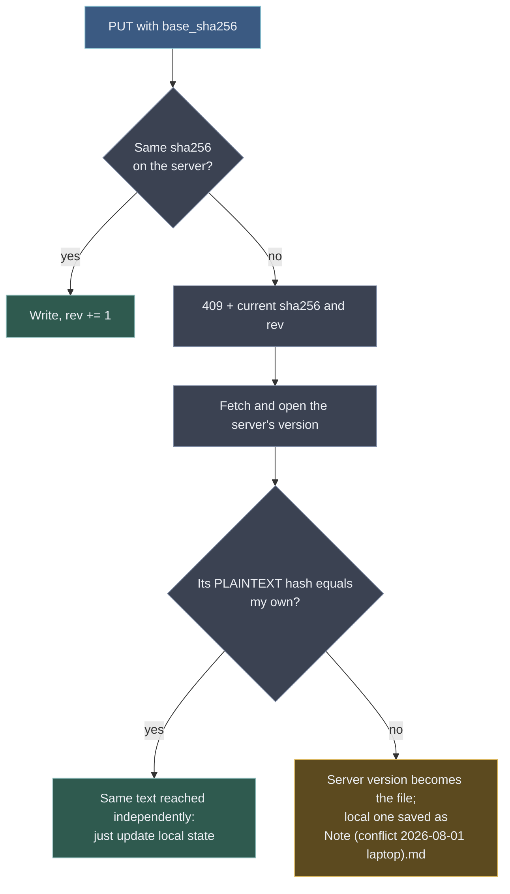

# 04 — Synchronisation protocol

## Authentication and the account surface

```
GET  /auth/kdf?login=…    → {account_salt, kdf_params}  before login; never returns a seed envelope
POST /auth/login          {login, auth_secret}          → access (15 min) + refresh
POST /auth/refresh        {refresh}                      → access
POST /auth/devices        {name, platform}              → device_id
POST /auth/redeem         {invitation_token, auth_secret, account_salt, kdf_params,
                             pubkey, enc_privkey, wrapped_seed, recovery_key,
                             recovery_code_hash, initial_vault_id, initial_vault_name_enc}
                                                   → access + refresh + device_id + vault_id
POST /auth/pairings       {device_pubkey}               → {pairing_id, pairing_secret}
POST /auth/pairings/{id}/approve
                            {pairing_secret, seed_envelope} authenticated existing device only
POST /auth/pairings/{id}/claim
                             {pairing_secret, name, platform}
                                                    → {seed_envelope, enc_privkey, account_salt, kdf_params, device_id}
POST /auth/recover        {login, recovery_code}         → {recovery_key, enc_privkey, account_salt, kdf_params}
GET  /vaults              → [{id, name_enc}]             the account's vaults; sync targets one of them
POST /vaults              {id, name_enc}                 → {id, root_node_id}
PUT  /vaults/{vault_id}   {name_enc}                     → 204; rename
DELETE /vaults/{vault_id}                              → 204; an empty vault that nothing still names —
                                                         see below, an ended share holds it longer than
                                                         "no live share" suggests
POST /vaults/{vault_id}/reset                           → {reset_epoch, root_node_id}
GET  /usage               → {used, quota, frozen}        account-wide — quota is per account (AC-Q2),
                                                         and `frozen` is the state that follows from it
```

Every secret this section sends — `auth_secret`, the invitation token, the recovery code, the refresh token —
is verified against a **SHA-256 hex** hash compared in constant time, and every one of them must be at least
128 bits of CSPRNG output for that to be sound (#108, [06](06-key-model.md)).

The passphrase never reaches the server. The client uses it to derive a KEK and unwrap a stable random
**seed**; the seed yields `auth_secret`, sent here and hashed again on arrival, and per-vault keys
`KV = HKDF(seed, vault_id)` that stay on the device. If both sides used the same material, the server would
receive a vault key on every login and E2EE would be decorative. A successful login opens the **account
surface** — the vault list and quota — from which the client picks a vault to sync. Details in
[06 — Key model](06-key-model.md).

The client generates every vault UUID before it encrypts that vault's label: it derives `KV` from the UUID,
then sends the UUID and `name_enc` together at redeem or `POST /vaults`. The server creates the key-scope
record, vault row and unnamed root for that supplied UUID; it never assigns an id after `name_enc` was made.
`PUT /vaults/{vault_id}` renames only the encrypted label.

**`DELETE /vaults/{vault_id}` waits longer than "no live share".** It needs the vault to have no non-root
nodes and to be named by no `shares` or `share_members` row at all — and an **ended** share keeps naming it.
Ending a share is a state change, not a delete (#44), because offline participants must still learn of it
from their delta, so the collector removes that row only after the journal TTL. A vault that hosted a share
is therefore undeletable for up to 90 days after the share ends, even when it is empty and the share is long
over. The endpoint reports that as a reason rather than a bare conflict; there is no way to shorten it that
does not take the news away from someone who was offline. `POST /vaults/{vault_id}/reset` is the explicit client-wins
operation: it hard-deletes only unshared nodes, retains the root, every marked share replica **and the
ancestor chain each replica hangs from** (`parent_id` is `ON DELETE RESTRICT`, so a delete set that ignored
those parents would simply fail), increments that vault's `reset_epoch`, and returns the new epoch before
the client uploads its replacement tree.

Claiming an approved pairing consumes it exactly once, creates the `devices` row from the supplied `name`
and `platform`, and binds that row to the approved account before returning the seed envelope **and** that
account's encrypted `enc_privkey`. Recovery likewise returns `recovery_key` (the seed bootstrap material)
and `enc_privkey`. A newly bootstrapped device needs both: the seed restores its vault keys and the encrypted
private key restores its account identity for receiving shares.

`/auth/kdf` solves account enumeration, not device bootstrap. A second device has no seed and therefore no
`auth_secret`; it obtains the seed only by either pairing with an already authorised device or proving the
high-entropy recovery code. Pairing relays an envelope encrypted to the new device's ephemeral public key;
the server never receives plaintext seed. Recovery verifies the submitted code against `recovery_code_hash`
under rate limiting, then returns `recovery_key` already wrapped under that code together with `enc_privkey`.
Neither route makes a passphrase-derived envelope available merely from a login name.

### Two endpoints take a login, and both answer the same way for one that does not exist

`/auth/kdf` must answer **before** authentication, so a `404` for an unknown login would turn it into an
account enumeration oracle. For unknown logins it returns a **deterministic fake salt**,
`HKDF(server secret, login)` — indistinguishable from a real one and stable across requests, which a
random salt would not be.

`GET /shares/{id}/recipients/{login}/pubkey` is the other endpoint that takes a login, and it follows the
same rule for the same reason: an unknown login receives a **deterministic fake `{user_id, pubkey}`**, also
derived from a server secret, never a `404`. Without that, every account able to open a share — which is
every account — could probe who else exists on the server, in a document that spends a decision (#73) on
closing exactly that hole one endpoint over.

Two more measures, because a single uniform answer is not by itself enough:

- **rate-limited per calling account**, like recovery. A uniform response stops one probe from telling
  anything; the limit stops a list of probes from adding up to the same answer;
- **`POST /shares/{id}/invite` fails generically** for a `user_id` that names no account. It must not say
  "no such account" — that is the same oracle, one call later.

**The residual is named rather than claimed away.** A determined caller who follows a probe through to an
invite still learns, from the failure, that the account does not exist; rate limiting bounds how often, and
the attempt is an auditable administrative event. That is weaker than `/auth/kdf`'s guarantee, and
proportionate for a different reason: this endpoint sits behind authentication on a server where accounts
exist only because an administrator issued an invitation, so the caller is already a known member of a
family-sized server rather than an anonymous stranger.

### First run: the server serves one thing until it has an administrator

`schema.sql` seeds an unredeemed invitation for the first administrator (#107) — the only shape the server
can create, since keys are born on a device. While no account is both `active` and `admin`, the API answers
**only `/auth/kdf` and `/auth/redeem`**; everything else is `503` with a reason naming the bootstrap. The
console shows the same thing instead of a login form.

Two properties make a default credential acceptable here, and both have to hold:

- **redeeming it is what replaces it.** The token is the literal `admin`; redemption consumes the invitation
  and fills the row with the operator's own key material, so there is no state in which the default still
  works;
- **while it is outstanding the server does nothing else.** The window is the first run, not "until somebody
  remembers". If the invitation expires unredeemed the server re-arms it on start — a bricked server helps
  nobody, and the guard above is what makes re-arming safe.

Once an administrator is active the bootstrap path is closed permanently: the seeded row is that
administrator's account, and `users_last_admin_stays` keeps at least one of them from then on.

The database connection is described by `PGHOST`, `PGPORT`, `PGUSER`, `PGPASSWORD` and
`PGDATABASE` when they are present, and by `DATABASE_URL` when it is. Discrete variables
are what the container uses, because a password put into a URL has to survive being escaped
into one — `openssl rand -base64` emits `/`, and a single `/` turns the authority into a
path. The server then fails to start with "Invalid URL" and nothing pointing at the
password.

## Namespace: there are no paths in the protocol

The client holds the tree locally, so a path exists on the client and never in a request: it resolves its
own path to a `node_id` and sends the identifier. The server does not assemble paths at all — which is
also why E2EE needs no separate protocol.

Consequences:

- **a share needs no path translation, and no namespace of its own.** A participant's copy is ordinary
  nodes in their own vault ([05](05-sharing.md)), so there is nothing to translate between;
- **moving into another vault is unrepresentable** — `move` changes `parent_id` within one vault; it has
  nowhere to put a different `vault_id`. Crossing vaults (even two of one account) is a `del`+`put`, not a
  move, because the keys differ. A write inside a shared folder is likewise not a move across vaults; it is
  one write applied in each participant's own vault.

## Endpoints

```
GET    /vaults/{vault_id}                → {root_node_id, head_rev,
                                           scopes: [{scope: "vault"|"share", id?, key_id}]}
                                          where a client starts syncing this vault. A share is
                                          still a scope: its content is the caller's own nodes,
                                          but their names are under the share key, not the vault key

GET    /vaults/{vault_id}/delta?cursor=<opaque>&limit=500
       → {changes: [{node_id, parent_id, name_enc, name_hmac, name_key_id, op, rev,
                     sha256, size, mtime, share_id?, author_id?}],
          events:  [{type: "share_ended", share_id, by, at},
                    {type: "account_frozen"|"account_thawed", at}],
                   the freeze is an account state, not a share one (SH-20),
                   so its event names no share
          next_cursor, has_more}
       410 {reason: "journal_ttl" | "restore" | "reset"}
           the reason is mandatory: it decides whether the resync applies deletions.
           One journal per vault; the cursor names its vault

POST   /shares            {vault_id, node_id, subtree_key_id, wrapped_key_initiator}
                                                → {share_id, state: "preparing"}
POST   /shares/{id}/prepare
                            {items: [{node_id, name_enc, name_hmac, name_key_id,
                                     blob_envelopes, dedup_tags}]}  initiator only, resumable batches
POST   /shares/{id}/activate                   initiator only; verifies preparation completeness
POST   /shares/{id}/cancel                     initiator only, while preparing; no participant copy
                                                exists yet, so the share goes straight to cancelled
GET    /shares/{id}/recipients/{login}/pubkey  initiator only → {user_id, pubkey}
                                                an unknown login gets a deterministic FAKE pair, not
                                                a 404 — the same rule as /auth/kdf; rate-limited
POST   /shares/{id}/invite {user_id, wrapped_key}
                                                initiator only; active share only
GET    /shares            → {joined: [{share_id, vault_id, is_initiator, state}],
                             invitations: [{share_id, initiator_login, invited_at}]}
                                                what the account is in and what is waiting for it.
                                                `is_initiator`, not a role — there are none (SH-10).
                                                The client shows this as a list the user opens;
                                                nothing is pushed at them
GET    /shares/{id}/members
                          → [{user_id, login, is_initiator, invited_at, joined_at?, finalizing}]
                                                any live member; who is in the share and who has an
                                                outstanding invitation. Absence is the only record of
                                                a decline — the row is deleted, so nothing else remains
POST   /shares/{id}/join  {vault_id, parent_id, name_enc, name_hmac, name_key_id}
                                                accept; `vault_id` is the vault the accepting client is
                                                running in, not an answer the user was asked for (AC-Q4).
                                                The replica root lands under this local parent, checked
                                                against account quota; active share only, redeemed once
POST   /shares/{id}/decline                    invitee only, before joining; the membership row is
                                                DELETED, so the slot is freed at once
DELETE /shares/{id}/members/{user_id}          initiator only. Against a member who has JOINED this is a
                                                revoke: it stops their propagation and requires their
                                                later finalize-leave. Against an outstanding INVITATION
                                                it withdraws it, deleting the row — there is no replica
                                                to finalize and nothing to keep
POST   /shares/{id}/leave/begin                member stops propagation and starts local finalization;
                                                the initiator uses it too, and it ends the share
POST   /shares/{id}/finalize-leave
                           {nodes: [{node_id, name_enc, name_hmac, name_key_id,
                                     vault_envelopes, vault_dedup_tags}]} affected member only

HEAD   /blobs/{sha256}                  → 200 = caller has a live reference; 404 otherwise
POST   /blobs                           → chunked, resumable, 4–8 MB parts (blobs are account-global)
GET    /blobs/{sha256}                  → content, supports Range

GET    /vaults/{vault_id}/blob-keys?sha256=a,b,…
                                               → {keys: [{sha256, scope_id, wrapped_key}]}
                                               batched; an address the caller cannot open is
                                               OMITTED, the same 404-not-403 rule as a blob read (#20)
GET    /vaults/{vault_id}/dedup?tags=a,b,…
                                               → {matches: [{content_tag, sha256}]}
                                               batched; scoped to the vault's OWN key scope —
                                               self-consistent, not an oracle (docs/07 adoption)

POST   /vaults/{vault_id}/nodes  {parent_id, type, sha256?, size?, mtime, name_enc, name_hmac, name_key_id,
                                   blob_envelopes, dedup_tags}
                                               → {node_id, rev}   the server never sees a name (AC-08)
PUT    /vaults/{vault_id}/nodes/{node_id}  {sha256, mtime, base_sha256,
                                             blob_envelopes, dedup_tags}  → {rev}
DELETE /vaults/{vault_id}/nodes/{node_id}                  If-Match: <rev>  → {rev}
POST   /vaults/{vault_id}/nodes/{node_id}/move {parent_id, name_enc, name_hmac, name_key_id}
                                               If-Match: <rev>  → {rev}

GET    /vaults/{vault_id}/list?under={node_id}&snapshot=…  subtree listing for a resync
GET    /vaults/{vault_id}/versions/{node_id}    → [{rev, sha256, size, at, author_id}]
GET    /vaults/{vault_id}/trash?under={node_id}  → deleted nodes with live history
POST   /vaults/{vault_id}/restore {node_id, rev}  → a new put with an old hash → a new version
WS     /events                          → {vault_id, head_rev}   across the account's synced vaults
```

Quota is account-wide, so it lives at `GET /usage` (above), not per vault. Blobs are account-global storage
addressed by hash, so `/blobs` is unscoped; a vault reaches a blob through its own `blob_keys` envelope —
which is what `GET .../blob-keys` exists to hand over: applying a delta means decrypting every file that
changed, and there is otherwise no way to ask for the content key an address is wrapped under.

`GET .../dedup` answers the other half of the same problem, asked the other way round: **before** sealing
and uploading a file, or before accepting the server's copy of one that collides with it on a path, whether
this exact plaintext is already known in the vault's own scope. A match means a node can bind to the
existing address with no fresh envelope or upload — `nodes_check_private_material` only checks that the
material rows exist, not who wrote them or when ([03](03-data-model.md)). This is what makes adopting an
already-synced vault "nearly free" ([07](07-onboarding.md)): after matching by path, only metadata travels.

Both are authorised by **vault ownership**, not by the caller already holding what they are asking about —
the whole point of each is to learn something before that would be true. Neither is a new oracle: a
`blob-keys` address the caller cannot open is omitted exactly as a blob read would refuse it (#20), and a
`dedup` tag is `HMAC(scope key, sha256(plaintext))`, so only a holder of the vault's own key could ever have
produced the tags sitting in its scope to begin with — querying them back is self-consistent.

`POST /shares` and `/prepare` carry only opaque client-produced cryptographic material. The server verifies
scope, membership and completeness; it never derives `KS`, encrypts a name or seals an HPKE envelope. While
the share is `preparing`, initiator-side writes below the share root remain allowed but must use `KS` for
newly created or renamed shared nodes and include their envelope/tag material in the same write. Invite and
join remain forbidden until `activate` verifies that every current interior node and reachable version has its
required `KS` material.

`POST` and `PUT` node writes likewise carry `blob_envelopes = [{sha256, scope_id, wrapped_key}]` and
`dedup_tags = [{scope_id, content_tag, sha256}]` for every material row their new reference requires. The
server validates the caller, scope and blob relation, then writes the node, journal/version rows and material
in one server transaction. It never derives an envelope or a tag, and it never leaves a node committed without the
material needed to open or deduplicate it.

`type` is required on node creation and is either `file` or `folder`. A folder carries no content fields;
a live file carries `sha256` and `size` (and its upload/material rows). Type never changes after creation.

For a shared write, the command computes its fan-out set at execution time: members with `joined_at` set,
`finalization_started_at` and `left_at` unset, whose **account** is not frozen. It applies the write, journal, version,
head revision and material to every member in that set as one server transaction/API command, or applies none.
This is an application-level atomicity contract, not a claim that independent database triggers can prove
cross-vault fan-out; an integration test must inject a failing replica write and prove that no replica advances.
A member whose account is frozen receives neither inbound propagation nor outbound writes, and the same
freeze refuses any write that grows usage in **any** of that account's vaults — the quota it reflects is
per account (AC-Q2, SH-20). Deletes stay available, because they are the way out. On thaw it catches up from a live
replica with the current state plus retained versions from its frozen interval, falling back from journal delta
to a tree-and-versions walk when the journal has expired.

Each `prepare.items` element re-keys one existing **interior** node name and supplies the missing material for
blobs it introduces: `blob_envelopes = [{sha256, wrapped_key}]` and `dedup_tags = [{content_tag, sha256}]`.
The initiator's share-root name stays under its `KV`, because it is a sibling of private nodes. A joiner supplies
the replica root's local `KV`-encrypted name and parent — the two things their client genuinely has to ask a
human, and the only ones ([02](02-architecture.md)); that label and location never propagate. The server
rejects an item outside the initiator's subtree, an envelope/tag for another scope, or a `name_key_id` other
than this share's `subtree_key_id`. `activate` re-derives completeness from current nodes and versions rather
than trusting a client-side progress counter.

`GET /shares/{id}/members` is readable by **any live member**, not only the initiator. Hiding it would
protect nothing: authorship already names everyone who has written in the folder (SH-19), so the membership
is disclosed by the history whatever this endpoint does. Visibility is not control — only the initiator may
invite or revoke (SH-16).

It lists rows that are still live: joined members, and invitations nobody has answered yet. It does **not**
carry another account's freeze state — that is an account-level fact about someone's quota, of no use to a
co-member (SH-20) — and it does not list people who have left. `finalizing` is true between
`finalization_started_at` and `left_at`, which is what "leaving, not finished yet" looks like from outside.

**There is no notification when somebody declines**, and none is needed. The row is deleted, so absence from
this list *is* the record; a client that keeps its own copy of the list sees the difference on the next sync
and can say "Bob declined" in its own log ([02](02-architecture.md)). Putting it in `events` instead would
tie the fact to the 90-day journal window, so an initiator who was away for a season would learn nothing —
a list has no expiry.

### Resolving an author's name

> **A deletion has no author, and that is a gap rather than a decision.** `author_id` in the delta comes
> from the `versions` row at that revision, and a delete writes no version — so `op: "del"` always carries
> `author_id: null`. Harmless while a vault has one owner, and exactly wrong for **M3**: in a folder shared
> with up to eight people, "who deleted this" is the question that gets asked, and the one entry that cannot
> answer it is the deletion. Whoever implements sharing has to decide where a delete records its actor
> before that milestone ships, not after.

`versions` returns `author_id`, and authorship outlives membership (SH-19), so a version written by somebody
who has since left is an id the membership list no longer contains. **The client keeps a name cache** —
`user_id → login` — populated from every membership list it fetches, and never evicted. A departed member's
name stays displayable because it was recorded while they were still in the share.

There is deliberately **no server-side `user_id → login` lookup**. It would answer for accounts the caller
has nothing to do with, turning any leaked id into a way to enumerate the server's users, and it would do so
to solve a display problem the client can solve locally.

Two consequences, both accepted:

- **a device that never saw the person shows the raw id.** A device paired after someone left, or a fresh
  install, has an empty cache for them. It shows the id rather than inventing a name — "unknown author" is
  honest, a wrong name is not;
- **the cache is per vault**, because a plugin instance is ([02](02-architecture.md)). Two vaults of one
  account each learn the names they see, and neither is authoritative for the other.

The cache is also why the fake pair returned for an unknown login costs nothing: it is never cached against a
real id, because no membership row ever names it.

Leave, revoke and ending a share never ask the server to derive `KV` material. They first stop propagation by
starting finalization for each affected member. The affected client then calls `finalize-leave` with the
KV-envelopes, KV-tags and KS→KV names for its own replica. The server atomically validates and unmarks that
replica; only then does it write `left_at`. A revoked offline device may finish later, but receives no new
share changes while finalization is pending. A `preparing` share may be cancelled; an active share ends only
after every live participant has entered or completed finalization.

## The cursor

The client stores one value **per vault** and asks "what changed after this". It is **one integer plus the
two epochs**, naming its vault — a position in that vault's journal, and nothing else:

```
token   = base64url(payload) "." base64url(tag)
payload = {v: 1, uid: <user_id>, vid: <vault_id>, epoch: {restore: R, reset: S}, rev: N, hwm?: M}
tag     = HMAC-SHA256(cursor_key, base64url(payload))
```

A participant reads one log — their own vault's — so a share adds no position to the cursor and nothing has
to be stitched. Everything the client needs to resume is that vault's `rev`.

### Why it is still authenticated

The token is signed and the server rejects a tag it did not produce with `400` — not `410`: a forged cursor
is malformed, not stale, and answering `410` would turn a mangled byte into a free full resync.

Be clear about what the signature is worth. A client that raises its own `rev` only skips its own changes in
its own vault, which is self-harm and not an attack. What it protects is the **epoch**:

| Forgery | Consequence |
|---|---|
| an `epoch` copied from a newer cursor | the `410` never fires — the client applies deletions it should not, or fails to resync after a restore. The epoch is the whole recovery protocol, and a client that can edit it can defeat it |
| a widened `hwm` | pages return rows the pinned snapshot was meant to exclude, so a change is applied twice or out of order |
| a raised `rev` | the client silently skips its own history. Its own problem — listed so nobody claims the signature for it |

Three properties to keep:

- **`uid` and `vid` are inside the payload**, so a token cannot be replayed against another account, nor
  against another vault of the same account, even with a valid tag;
- **`cursor_key` is a server secret**, rotated with an overlap — the server verifies against the current
  key and one previous one, so a rotation does not `400` every device at once;
- **a `400` carries a reason, and one of them is recoverable.** `reason=cursor_unverifiable` means "this
  token is not one I can check — start again from an empty cursor", and the client resyncs in full without
  applying deletions. Without it, a device offline across two rotations is bricked: its token verifies
  under no surviving key and it cannot ask for a new one. A tamper check whose only outcome is a dead end
  fails closed on the wrong person.

The tag proves *authorship*, not *freshness*: replaying your own older cursor is an ordinary resume.
Staleness is still decided by the epoch and the journal TTL.

### Epochs

| `410 reason` | Raised by | What the client must do |
|---|---|---|
| `restore` — `server_meta.restore_epoch` | the server is restored from a backup | full resync **without applying deletions** |
| `reset` — `vaults.reset_epoch` | the user runs a "my client is the source of truth" reset **on that vault** (AC-14) | full resync **applying deletions** |
| `journal_ttl` — no epoch moved | the cursor is older than the oldest surviving journal row | full resync **applying deletions** |

The same signal, three reasons, and not the same reaction — which is why there are two counters and why the
`410` names the reason. One number would force the client to guess between "keep the local file" and "delete
the local file", and either mistake costs data.

**Why `journal_ttl` applies deletions and `restore` does not**, given that both end in a full walk: the
direction the server moved. A restore takes it **backwards**, so a node the client synced may be missing
because the backup predates it — absence proves nothing. An expired cursor leaves the server where it was,
moving **forwards**; the tree it lists is current. The client holds its own `path → node_id` state, so it can
tell the two local cases apart: a file it had synced (it knows the `node_id`) that the listing does not
contain **was** deleted, and a file it never uploaded is new and goes up. A hard reset would have moved
`reset_epoch` and arrived under its own reason, so it cannot be confused with this one.

**Both may only increase**, enforced by a trigger. Lowering an epoch makes every stale cursor look current
again, which disables the exact mechanism the epoch exists to provide.

**A device can be stale in both epochs at once, and it is answered only once.** A client offline across both
a restore and a reset comes back with a cursor stale in both; it resyncs under whichever reason the `410`
names, and the cursor it ends with carries both current epochs, so the other never fires. There is exactly
one answer, and it decides whether local files are deleted.

**When `restore` is among the reasons, `restore` wins and deletions are not applied.** The two instructions
are contradictory over the same set of local files, and the mistakes are not the same size: applying
deletions when the server has been rolled back destroys work that exists nowhere else, while *not* applying
them after a reset resurrects files the user chose to wipe — and the user wipes them once more. That is
`#70`'s trade, and it does not change because a second reason arrived with the first.

Deciding by which event happened **later** is not available: `server_meta.restored_at` records the restore,
but `vaults` carries `reset_epoch` with no timestamp, so the order of the two is not derivable. The rule
above needs no order, which is why it is the rule.

### Stable snapshot

Delta is paginated while the vault keeps changing. On the **first** request of a series the server pins an
upper bound — that vault's `head_rev`, and nothing else — and puts it in `next_cursor`; later pages
return only rows below it. When `has_more` is false the bound becomes the new position.

`GET /vaults/{id}/list` does the same through `snapshot`, which the client uses as its starting cursor after
the walk. Without this, a resync of a large vault will reliably either lose a change that happened mid-walk
or apply it twice.

### Expiry

The journal has a 90-day TTL. A cursor older than the oldest surviving entry gets `410`.

**There is no per-object `410`.** With one journal per vault there is nothing that can expire separately —
a vault's cursor is either inside the window or it is not. A share cannot fall behind on its own account
either, because its changes land in that same journal as they happen.

A **frozen** participant (SH-20) is the one case that can outlive the window, and it is handled elsewhere:
thawing falls back to walking the folder plus the version rows for the interval, and does not depend on the
journal at all ([05](05-sharing.md)).

## The sync cycle

**push → pull → apply.** Local changes go out first. The reverse order hides conflicts: the client would
apply the server's version over its own and only then discover there was a conflict.

## Conflicts

The precondition for a write is **content**, not a revision number.

`nodes.rev` increases on *any* operation, `move` included. Using it as the precondition would turn the
everyday sequence "renamed on the desktop, edited on the phone" into a `409` and a conflict file — two
changes that do not overlap at all. So `PUT` carries `base_sha256`: "I edited *this* version of the text".
A rename does not invalidate that statement. `rev` remains the precondition for `move`, where the subject
really is placement.



The "hashes match" branch matters: two devices often reach identical content independently — editing
frontmatter back and forth, for instance. Without it the user collects conflict files for nothing.

> **The comparison is on plaintext, and it cannot be done any other way.** `KC` is random, so the same
> text sealed twice lands at two different addresses ([06](06-key-model.md)) — the `sha256` the `409`
> carries and the one just uploaded will differ even when the content is identical. Comparing them would
> call every independently-reached agreement a conflict, which is the exact case this branch exists to
> prevent. So the client fetches the server's version and hashes what it decrypts. That costs a round
> trip, on the rare path where a write was refused, and it is the only honest way to ask the question.

Conflict files are never removed automatically and synchronise as ordinary notes. The conflict panel in
the plugin is simply a list of them with a diff.

## Rename detection

- **inside Obsidian**: `vault.on('rename')` gives the pair directly → `move`, and links survive;
- **outside Obsidian** (file manager, script): a rescan heuristic — a path disappeared, another appeared
  with the same `sha256` in the same cycle → treat as a move.

The heuristic must be conservative: for small identical files (empty notes, repeated icons) it misfires.
Restrict it to a unique candidate above a few hundred bytes; otherwise fall back to `del` + `put`, which
costs nothing extra because the blob is deduplicated anyway.

History survives a rename on its own, being keyed by `node_id`. What a `move` *does* require is recomputing
`ancestry` for the whole subtree in the same transaction — and, inside a shared folder, applying the same
move to every participant's corresponding node.

`move` is valid only when the node and destination stay on the same side of a shared-folder boundary. A move
into or out of a shared folder returns `409 {reason: "share_boundary"}`; the client must copy/put the item
with the required destination-scope material, then delete the source. This keeps scope conversion atomic at
the write level without making a tree move silently create partial cryptographic metadata.

## Blob transfer

`PUT` carries only a hash, never content: upload the blob first (deduplicated via `HEAD`), then the
metadata. Re-sending the same file therefore costs one `HEAD`.

### Where a blob lives

`storage_key` is `<first 2 hex>/<next 2 hex>/<full hex>` — two levels of fan-out, then the whole address as
the filename, no extension. Two levels keep a store of tens of thousands of blobs at hundreds of files per
directory instead of tens of thousands, which is where directory listings and some filesystems start to
hurt; a third level is premature at this scale. The **full** hash is the filename, not a remainder of it, so
a blob found in a backup identifies itself without the database.

**A blob is written to a temporary name and `rename()`d into place**, on the same filesystem. That rename is
the commit point: a blob is either absent or complete at its address, never half-written under it. It is
what makes the collector's re-check ([03](03-data-model.md), step 7) safe, and what an interrupted upload
leaves behind — a temp file the parts TTL sweeps, not a corrupt blob.

`storage_key` stays a stored column rather than something derived from `sha256`, so moving the store to
S3-compatible object storage is a configuration change and not a schema migration.

### Authorisation

> A hash is not a capability.

Deduplication means the same `sha256` is visible to many users. If `GET /blobs/{sha256}` checked only
*existence*, anyone who learned a hash — from their own copy of the file, from a log — could read someone
else's content.

Both `HEAD` and `GET` therefore require a **live reference belonging to the caller**, and under replication
that is a single condition: `user_blobs.refs_own > 0` — the blob is held by one of their own nodes or by
their own history.

There is no second branch. A participant's replica is their own content, so a share grants no access that
ownership does not already describe — and the rule that revocation must not wait for the former member to
act enforces itself.

No reference means `404`, not `403` — a `403` confirms that a file with that hash exists.

The same check guards everything that returns content or metadata: `delta`, `list`, `versions`, `trash`,
`restore`, blob `HEAD`/`GET`, **and `dedup_index` lookups**. Separate checks per endpoint are precisely
where one eventually falls behind the rest.

**Revocation stops the flow of new content; it does not take back old content.** Anyone who was a
participant holds a full copy, by construction (SH-02). That is a property of the model, stated so it is
not mistaken for a gap: there is no "what did they manage to download" question to adjudicate, and
therefore no machinery to adjudicate it.

### Upload limits

`POST /blobs` needs no rights to a specific blob — possessing the content hash proves possession of the
content. That is not the same as needing no limits: without them it is the simplest way to fill the disk,
and it does not take an attacker, just a client stuck in a retry loop.

| Limit | Default | Why |
|---|---|---|
| authenticated session **and** registered device | — | nothing anonymous; there is someone to account and throttle |
| quota reserved before the upload starts | — | otherwise quota is checked after the bytes are already on disk |
| bytes per minute, per account | **200 MB/min** | separate from the request rate limit: here the problem is volume. High enough that a first upload does not crawl — migration raises it further for the session ([07](07-onboarding.md)) — low enough that a stuck client cannot fill a disk in an hour |
| ceiling on unfinished uploads, per account | **2 GB** | uploads occupy disk while they are in progress; more than one real migration session needs |
| TTL on abandoned parts | **24 h** | an interrupted upload must not live forever |
| TTL on an **unbound** blob | **48 h** | uploaded and never referenced by a node: swept after this, counted against quota while alive |
| TTL on the delta journal | **90 days** | append-only log, pruned on its TTL so a stale cursor gets `410 journal_ttl` instead of being answered from a gap |

The part size for a *resumable* upload (**8 MB** in the roadmap) belongs to the resumable
protocol, which is M2 — this M0 server takes whole blobs over one `POST`, so there is
nothing on this side of the wire for a part limit to govern, and none exists in config
until it does.

Every limit above is enforced by the running server or by the collector; the defaults are
what a family-sized server runs with.

**A refused upload says how long to wait.** Over the volume limit the answer is `429` with
`Retry-After`, computed from when enough of the window rolls off to fit *this* upload — not
a flat minute. A refusal without a wait turns a client stuck in a retry loop into the same
client stuck in the same loop, which is the situation the limit exists for in the first
place.

**The window is counted in the process.** With one server that is exact; with two behind
one address each would allow the full rate, so a shared counter becomes necessary the
moment this stops being a single process. One process is what the deployment is
([02](02-architecture.md)), and this is written down so that changing it is a decision
rather than a surprise.

**An upload also checks the device**, not just the session (#33): an access token names a
device and outlives the row, so without this "sign out this device" would be advice rather
than an act for as long as the token lives (#90). It is checked here rather than on every
request because this is the path where being wrong costs disk.

Two of them are not independent, and getting the order wrong breaks uploads rather than limiting them: **the
TTL on parts must stay strictly below the TTL on an unbound blob.** Reversed, the blob is swept while its
own upload is still in progress, and the client retries into the same wall for ever.

The unbound-blob row closes the quietest hole: without it, content can be parked on the server at no cost.

**Only the *unbound blob* has a database row; the *parts* of a resumable upload do not.** The unbound state
is `user_blobs` with `refs_pending > 0` ([03](03-data-model.md)) — a row the server clears when the blob is
bound and sweeps on its 48 h TTL. The parts in between are staging files in the blob store: the same
temp-name-then-`rename()` area, written by the client's chunked `POST`, and counted/measured and swept by
the application, not by rows. That is why the schema has no `parts` or `uploads` table and none is needed —
a part is an incomplete write, and an incomplete write is exactly what the temp-name scheme exists to
leave behind as sweepable.

**`POST /blobs` deliberately has no short-circuit.** Answering "I already have this hash, skip the upload"
would reintroduce the existence oracle that the `404` rule closes — the client declares the hash up front,
so anyone with a copy of a file could test for it. The server accepts the upload silently and deduplicates
internally. The cost is traffic in the rare "two users hold the same file" case.

A pending row is cleared as soon as the blob is bound by **any node the uploader was entitled to create** —
by fact of binding, not by which vault the node ended up in. A write into a shared folder binds the blob in
the writer's own vault and in every other participant's, all in one transaction; keying the clearing to a
single vault would leave the pending row hanging until TTL, occupying quota for a file that is already
referenced.
