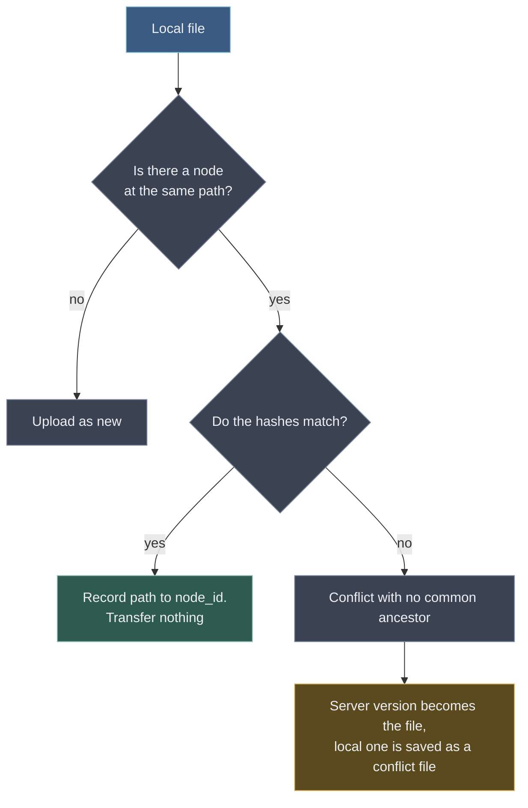

# 07 — Onboarding, migration and resets

## From nothing to a synchronising vault

The whole start-up path, end to end. Two things about it are not obvious from the component diagrams:
the account is **created in two places** — an invitation on the server, keys on the device — and the
passphrase never crosses the boundary between them.

```mermaid
sequenceDiagram
    actor Admin
    participant Console as Management console
    participant API as Sync API
    participant DB as PostgreSQL
    actor User
    participant Plugin as Obsidian plugin

    Note over Admin,DB: 1 — An account begins as an invitation, never as a full row
    Admin->>Console: create user: login, quota
    Console->>API: POST /admin/invitations
    API->>DB: users row, state = provisioned, token hash, NO keys
    API->>DB: audit_log: invite.create
    API-->>Console: one-time link and expiry
    Console-->>Admin: link to hand over out of band

    Note over User,Plugin: 2 — Keys are born on the device, from a passphrase the server never sees
    Admin->>User: the invitation link
    User->>Plugin: server address, token, chosen passphrase
    Plugin->>Plugin: account_salt = 16 random bytes; KEK = Argon2id(passphrase, account_salt)
    Plugin->>Plugin: seed = 32 random bytes; wrapped_seed = AEAD(KEK, seed)
    Plugin->>Plugin: initial vault UUID; auth secret and per-vault key = HKDF branches of the seed
    Plugin->>Plugin: X25519 keypair, private key sealed under an account key from the seed
    Plugin->>Plugin: kek_verifier = HKDF(KEK, "recovery" ‖ login ‖ salt), so the phrase can be proved later
    Plugin->>Plugin: optionally a recovery code, its verifier hash, and the seed sealed under it too
    Plugin-->>User: a forgotten passphrase loses every vault unless a recovery code was kept

    Note over Plugin,DB: 3 — Redeeming the invitation completes the account
    Plugin->>Plugin: derive KV from initial vault UUID; encrypt initial vault name
    Plugin->>API: POST /auth/redeem with invitation token, auth secret, account salt, KDF parameters, public key, sealed private key, wrapped_seed, kek verifier, initial vault UUID and name_enc
    API->>DB: check the token and its expiry
    API->>DB: fill the key columns, state = active, create the client-identified named vault and its root
    API->>DB: audit_log: account.activate
    API-->>Plugin: access and refresh tokens, device id

    Note over Plugin,API: 4 — First contact: pick a vault, then its tree
    Plugin->>API: GET /vaults
    API-->>Plugin: the account's vaults [{id, name_enc}]
    Plugin->>API: GET /vaults/{id}
    API-->>Plugin: root node id, head_rev, key scope per scope

    alt the local vault already has files
        Plugin->>Plugin: pre-flight — case collisions, forbidden names, quota, placeholder files
        Plugin->>API: GET /vaults/{id}/list under the root
        loop for every local file
            Plugin->>Plugin: match by path against the server tree
            alt hashes are equal
                Plugin->>Plugin: record path to node id, transfer nothing
            else nothing on the server at that path
                Plugin->>API: POST /blobs, then POST /vaults/{id}/nodes
            else hashes differ
                Plugin->>Plugin: server version keeps the name, local one becomes a conflict file
            end
        end
    else the local vault is empty
        Plugin->>API: first-upload mode — node created right after its blob, raised limits
    end

    Note over Plugin,API: 5 — Steady state, repeated for the life of the vault
    loop on every change, and on every wake-up
        Plugin->>API: push local changes, PUT carrying base_sha256
        Plugin->>API: GET /vaults/{id}/delta with the opaque cursor
        API-->>Plugin: collapsed changes, events, next cursor
        Plugin->>Plugin: apply. conflicts become files, never overwrites
    end
```

Three details the diagram makes concrete:

- **the verifier is made at step 2 and never asked for again until it is needed.** It costs the client
  nothing — the `KEK` is already in hand — and it is what lets a future device with no `data.json` prove the
  phrase. Nothing about it is shown to the user; what *is* said, once and plainly, is that a forgotten
  passphrase loses **every** vault unless a recovery code was kept, because the seed exists only inside
  envelopes one of those two things opens. **The recovery code is optional and its columns are null when
  there is none** — an account without one must say so rather than carry a placeholder;
- **the client creates the initial vault UUID before encrypting its name.** Redeem receives that UUID and
  client-supplied `name_enc`, so it can derive `KV = HKDF(seed, vault_id)` before producing the label; the
  server then creates the named vault and its root. The root is the one node with no name, so no key material
  is needed to make it. Later create/rename/delete operations use the account-level `/vaults` endpoints.
- **step 4 branches once and never again.** Adoption is a one-time reconciliation; after it the client is
  in the ordinary push–pull loop, and a second device entering later takes the same left-hand branch.

## Adding another device

A second device cannot start with `/auth/login`: `auth_secret` comes from the seed it does not yet have.
It first obtains the seed by one of two explicit bootstrap flows:

1. **pairing** — the new device shows an ephemeral public key and pairing secret; an already authorised
   device seals the seed to that public key and relays the opaque envelope through the server. Its one-time
   claim supplies its name and platform, creating and binding the device to the account, and returns both
   the seed envelope and encrypted `enc_privkey`;
2. **recovery** — the device derives the `KEK` from the passphrase and the pre-auth `account_salt`, proves it
   with `kek_verifier` to a rate-limited endpoint, and receives `wrapped_seed` and encrypted `enc_privkey`;
   it unwraps both with the `KEK` it already holds.

Only then does the device derive `auth_secret`, perform normal login, list vaults and enter adoption for the
vault it chooses. **The server never returns a seed envelope for a known login alone** — the second path
turns on proving the phrase that opens it, which is a different claim entirely.

### Pairing, step by step

Four calls, and only one of them is authenticated — a device with no seed has nothing to authenticate with, which is the shape of the whole
problem.

| | New device | Already authorised device |
|---|---|---|
| 1 | makes an ephemeral X25519 keypair and a **pairing code**, and registers `POST /auth/pairings` with the public key and `sha256(code)` | |
| 2 | shows the code; the person carries it | |
| 3 | | reads the code, `POST /auth/pairings/lookup` for the public key |
| 4 | | seals the seed with **HPKE** to that key and leaves it: `POST /auth/pairings/approve` |
| 5 | polls `POST /auth/pairings/{id}/claim`, which answers `409 not_approved` until step 4 happens | |
| 6 | opens the envelope, logs in, re-wraps the seed, and enters adoption | |

**The code is the credential, and the id is not.** The pairing's id is a handle for the device that created
it — it polls its own claim with it. Approval is addressed by the **code alone**, because that is the only
thing that crossed the human channel; requiring the id there would have meant carrying a UUID beside the
code for nothing ([D-110](09-decisions.md)). Claim answers a wrong code exactly as it answers an unknown id.

**The code is 128 bits**, in Crockford's base32 — 26 characters, grouped. Not shorter: nothing rate-limits
approval or claim, and a pairing lives ten minutes ([04](04-sync-protocol.md)). Crockford's alphabet rather
than RFC 4648's because it omits `I`, `L`, `O` and `U`, which is what makes normalising a typed code safe —
in RFC 4648 a `L` is a legitimate character and "the user probably meant a one" would corrupt a code that
was read correctly.

**The lookup step is not decoration, and it admits a limitation.** Sealing needs the recipient's public
key, and approval is the call that *submits* the envelope, so the key has to be fetched first. That means a
**malicious server could answer with a key of its own** and read the seed the approver then seals. Removing
it needs the public key to travel the human channel too, which is a longer code than a person will type;
the mitigations are the ten-minute life and that the human has just read the code off the device that
generated the key. It is recorded rather than papered over.

A shape that looks simpler and is broken, so that it is not proposed again: deriving the X25519 keypair
*from the pairing code*, which removes the lookup entirely. The server learns the code at approval — so it
would hold the private key and could open the envelope.

**The new device re-wraps the seed itself.** Claim returns `account_salt` and `kdf_params` but never
`wrapped_seed`, so the device asks for the passphrase, derives the same KEK and wraps the same seed
locally. This is why joining asks for a passphrase even though the seed arrives sealed: without it the
device could hold the seed but never lock and come back, having nothing to unwrap.

### Recovery, step by step

Pairing answers "I am adding a device". Recovery answers the harder question — **"the only device I had is
gone"** — and it is the one that decides whether this server is a backup or merely a transport between two
live machines. A vault the server holds in full and cannot return to the person who wrote it is not stored,
it is stranded.

The user has three things: the server address, their login, and the passphrase in their head.

| | What happens |
|---|---|
| 1 | `GET /auth/kdf?login=…` returns `account_salt` and `kdf_params`. Unknown logins get a deterministic fake, as everywhere (D-73) |
| 2 | the client runs `Argon2id` once — the same pass it would run to unlock — and derives `KEK`, then `kek_verifier = HKDF(KEK, "recovery" ‖ login ‖ salt)` |
| 3 | `POST /auth/recover` with the login, the verifier, and the new device's name and platform |
| 4 | the server compares against `kek_verifier_hash`, creates the device as pairing's claim does, and returns the seed envelope, `enc_privkey`, `account_salt`, `kdf_params`, `user_id` and `device_id` |
| 5 | the client unwraps the seed with the `KEK` already in hand, stores the connection, logs in normally |
| 6 | `GET /vaults`, choose one, and **adoption** materialises it — the same branch a second device takes |

**Nothing new is invented after step 4.** Recovery is a door, not a mode: past it the client is an ordinary
freshly-bootstrapped device, and everything that makes an empty vault fill up already exists. That is why
this costs a single endpoint rather than a subsystem.

**A wrong passphrase and an unknown login are the same refusal**, and both are counted. The limit is part of
the design ([06](06-key-model.md)), because this is the one endpoint where guessing pays: attempts back off
per login and per source, and each is recorded in the audit log.

**The recovery code is the same door with a different key.** Where the user has forgotten the phrase but kept
the code, step 2 disappears and step 3 carries the code instead; the server answers with `recovery_key` — the
seed wrapped under that code — and everything from step 6 is identical. One endpoint, two proofs, and each
returns only the envelope its proof opens ([06](06-key-model.md)).

**With one step that has no counterpart on the passphrase route: it sets a passphrase.** Somebody arriving
with a code does not know one, so between steps 5 and 6 the client derives a `KEK` from a passphrase the
person chooses now, re-wraps the same seed under it, and sends the new `wrapped_seed` and its `kek_verifier`
to `PUT /auth/passphrase` — together, because they describe one key from two sides. Without it the account
would be openable by its code and nothing else, for ever, which is not what recovering means.

The seed does not change, so **the code still works afterwards**. It has been out of wherever it was kept,
which is a good reason to replace it, and the screen says so rather than leaving it to be assumed.

`account_salt` stays as it is, here and anywhere else a passphrase is written. It is an input to the recovery
code's own derivation ([06](06-key-model.md)), so a rolled salt would quietly turn a written-down code into a
string that opens nothing — and the client could not re-wrap that envelope, having no code.

An account that never had a code has **null** in both columns, which is the account saying honestly that it
has none.

**What recovery does not do.** It does not survive losing both the phrase and the code, and it does not bring
back a vault the user deleted from the server. It brings back the account, and with it every vault the server
still holds.

## The connection itself: changing it, and ending it

A connection is a record, not a relationship: server address, login, device id, vault id, `wrapped_seed`,
`account_salt`, `kdf_params`. Two things a person does to it, and they are not the same thing.

**Changing the address does not touch anything else.** The account, the seed, the device and every key are
bound to the account and the vault, never to a URL, so moving from an address to a host name — or to a
tunnel, or to a different port — is an edit of one field. It must be presented as exactly that. Offering
"disconnect, then connect again" in its place would be dishonest twice over: it destroys nothing it needed
to destroy, and it costs a full bootstrap to undo, because the invitation token that first created the
account is one-time and gone.

**Disconnecting is deliberate, and it keeps the files.** It clears the local connection record and revokes
this device on the server, best effort; it deletes nothing in the vault and nothing on the server. What it
ends is *this device's* participation.

The client says what coming back will cost before it does any of it — pairing from another device, or
recovery with the passphrase — because for an account whose only device this is, disconnect and recovery are
the same door in opposite directions. That is why disconnect may not exist before recovery does: without it,
the button is an exit with no handle on the outside.

## Adoption

What happens when the plugin first meets a vault that **already contains something**.

> This is not a migration nicety — it is a **base client mode** (D-74), because "there are already files on
> disk" covers the two most ordinary situations in the product's life:
>
> - **migration**: a vault of 10 000 files, an empty server;
> - **a second device**: the same vault is already on the phone (Syncthing or a cloud folder put it there)
>   and everything is already on the server.
>
> The second case is the dangerous one. The plugin's local state is empty, it knows no `node_id`, and
> without dedicated logic it either uploads duplicates or writes server files over local ones.

Before the first sync the client matches what is on disk against what is on the server **by path** — the
only key the two have in common.



| Case | Action |
|---|---|
| present on both sides, hashes equal | record the `path → node_id` mapping only; **no bytes move** |
| present on both sides, hashes differ | conflict with no ancestor (below) |
| local only | upload as new |
| server only | download |
| folder on both sides | match by path, recurse |

**For a second device this is nearly free.** The content is already on the server, so after matching only
metadata travels: the client asks `dedup_index` in its own scope by content tag and learns the blob is
already there.

### Conflicts with no common ancestor

The conflict model rests on `base_sha256` — "I edited *this* version". During adoption **nobody** has a
base: two independent files simply landed on the same path.

The rule is therefore separate and deliberately conservative: **the server version becomes the file, the
local one is kept as a conflict file.** Neither is overwritten silently, and the choice stays with the
person. It is the only conflict in the system that arises without any concurrent write.

## Pre-flight checks

A migration must fail **before the first byte, not halfway through**. The client walks the vault and
reports:

| Check | Why before the start |
|---|---|
| case collisions (`Note.md` and `note.md`) | the case-insensitive rule will reject them; learning that at file 4 000 is worse than at file 0 |
| forbidden characters, reserved names, trailing dots | same |
| **total size against quota** | a 20 GB vault against a 10 GB quota should produce a number up front, not an error midway |
| **placeholder files** (iCloud `.icloud`, OneDrive, sparse) | uploading a stub instead of the content is silent data loss — the worst possible outcome of a migration |
| symlinks | skipped with a report: following one either escapes the vault or drags in a foreign tree |
| artefacts of the previous synchroniser | `.stfolder`, `.stversions`, `~sync-conflict-*`, `_remotely-save-metadata-on-remote.json`, `conflicted copy` |
| **signs of a running synchroniser** | warn before the start, not while untangling the consequences |

Every item is a fork — fix, skip with a report, or cancel. Nothing passes silently.

## First-upload mode

> **Our own safeguards block a legitimate migration.** The anti-abuse limits cap unbound blobs, bytes per
> minute and abandoned upload parts — against someone filling the disk. A first upload of 10 000 files
> looks **exactly the same** to those rules and will hit a ceiling halfway.

So there is an explicit first-upload mode:

- raised limits for the duration of a migration session, accounted as such;
- **the node is created immediately after its blob**, so `refs_pending` does not accumulate by the
  thousand;
- progress, and resumption after an interruption: what was uploaded stays uploaded, and adoption continues
  from where it stopped.

## Migrating from a specific tool

**Turn the old one off first.** Leaving Syncthing running creates a feedback loop: it writes a file, our
watcher uploads it; we write, it propagates to other devices where our plugins upload again. Its conflict
files then travel to the server as ordinary notes.

| From | What to account for |
|---|---|
| **Syncthing** | disable; exclude `.stfolder`, `.stversions`, `~sync-conflict-*` |
| **Obsidian Sync** | disable; version history **does not transfer** |
| **Remotely Save** | disable; remove `_remotely-save-metadata-on-remote.json` |
| **iCloud / OneDrive / Dropbox** | turn off "optimise storage" and wait for a full download — otherwise the disk holds stubs, not files |
| **LiveSync** | disable; its database in `.obsidian` is not needed |

## Resets: when merging is not what you want

Adoption overwrites nothing, which is exactly why it sometimes does not fit. After a messy migration, after
a restore from an old backup, or after a divergence, the user often **knows** which side is right and does
not want to sort through hundreds of conflict files. Two opposite operations — both present in Joplin, both
worth having:

| Operation | Effect |
|---|---|
| **client is the source of truth** | **hard-destroys this vault's server state** and re-uploads the local vault |
| **server is the source of truth** | wipes the local vault and downloads everything from the server |

The second is simple: purely client-side, the server does not change, no epoch moves. The first is the
reason this section exists.

### What a reset touches — and what it must not

> **"Everything of mine on the server" is dangerously ambiguous.**
>
> A reset acts on **one vault's** own nodes **outside any share**, and on nothing else (SH-27). Every node
> carrying a share mark is excluded — the folders they joined and the folder they opened themselves alike.

The exclusion is load-bearing. A replica **is** the participant's own nodes in their own vault, so a reset
that swept "everything of mine" would take the replicas with it, and every one of those deletions would
propagate (SH-11): one person reinstalling Obsidian and choosing "my client wins" would empty the shared
folders of up to seven other people.

A reset therefore never refuses because the user owns an active share. That folder is excluded like any
other share, so the reset proceeds and leaves it alone.

### Erasure is hard

A reset **hard-destroys** the vault's own nodes rather than soft-deleting them (AC-14). The prior server
state is gone — no trash, and **not recoverable on the server**; the client is the source of truth by
definition, so its upload is what remains.

What this buys: **space held by nodes and their history is freed at once**, with no leftover trash
occupying quota and no separate "purge permanently" step. The cost, which the dialog must state before the
button: a mistaken reset cannot be undone from the server — only re-uploaded from a client that still holds
the data. Other devices are still protected, because they quarantine rather than delete (below).

> One exception, and it is deliberate. A blob carrying an **outstanding pending claim** — uploaded and not
> yet bound, including the surplus claim a re-upload of already-held content leaves behind — keeps its quota
> row through the reset and is released by the collector on the unbound TTL instead. The recount cannot tell
> a stale claim from an upload that is in flight *right now*, and sweeping the second one would charge the
> account nothing for bytes that are on the disk. So the reset frees what it can prove is unreferenced, and
> the rest expires. On a vault whose only file was uploaded twice, this shows up as usage that stays put
> until the TTL — which is correct, not a leak.

### The consequence for other devices — a mirror of restore

| Event | What another device sees | What it must do |
|---|---|---|
| **server restored from a backup** | a cursor from a foreign epoch | resync **without applying deletions**: local files missing on the server are uploaded as new |
| **client-wins reset** | a cursor from a foreign epoch | resync **applying deletions**: otherwise it resurrects exactly what the user deliberately wiped |

A cursor can be stale in both at once; then the reason is `restore` and deletions are not applied — the
protective instruction never loses to the destructive one ([04](04-sync-protocol.md), D-70). The third `410`
reason, `journal_ttl`, is not an epoch at all and does apply deletions; it is in [04](04-sync-protocol.md).

One signal, two opposite correct reactions. That is why the epoch must say **what happened**, and does so
with two counters rather than one: `server_meta.restore_epoch` (server-wide) and `vaults.reset_epoch`
(per vault). The `410` names the reason and the client picks its behaviour from it. A single number would
force a guess between "keep the local file" and "delete the local file", and either mistake costs data.

> **Deletions on other devices are not silent either.** A device receiving `410` with reason `reset` shows
> a confirmation and does **not** erase files from disk: what is missing on the server moves to a folder
> outside synchronisation, `_Reset 2026-08-01/`. "Never delete the user's files silently" has no exception
> even when the user ordered the deletion — just on a different device.

### Order

1. **pre-flight checks** — the same as for a migration: quota, names, placeholders. A reset is a full
   upload, so it needs the same guarantees;
2. call **`POST /vaults/{id}/reset`**. The server atomically hard-deletes the vault's own nodes where
   `share_id IS NULL`, preserves its root and all replicas, and increments `reset_epoch`. **The folders a
   replica hangs from survive too**: a replica root's parent is an ordinary unmarked node, and `parent_id`
   is `ON DELETE RESTRICT`, so the delete set has to exclude the ancestor chain of every retained replica or
   the whole operation fails. The client re-uploads into that surviving chain rather than recreating it;
3. upload the local vault as new nodes, with **new `node_id`s**, again excluding anything inside a shared
   folder: those already exist and are not the reset's to recreate. Almost no bytes travel — the blobs are
   already on the server, and `dedup_index` finds them in this vault's scope;
4. other devices get `410 reset`, confirm, and apply deletions into the quarantine folder.

Step 3 has a consequence worth stating to the user beforehand: **every file gets a new node id**, so for
other devices this is not "the same files" but a new tree. The old nodes and their history were hard-deleted
and do not carry over — a reset severs history by definition.

## Expectations to correct up front

- **history does not migrate.** Not from Obsidian Sync, not from anywhere: `versions` begins with the first
  write to this server;
- **`.obsidian/` is not synchronised by default** — someone arriving from Obsidian Sync expects the
  opposite and will wonder where their plugins went;
- **a second device's first connection looks like nothing happened** — and that is correct: the files are
  already there, only metadata moves.
