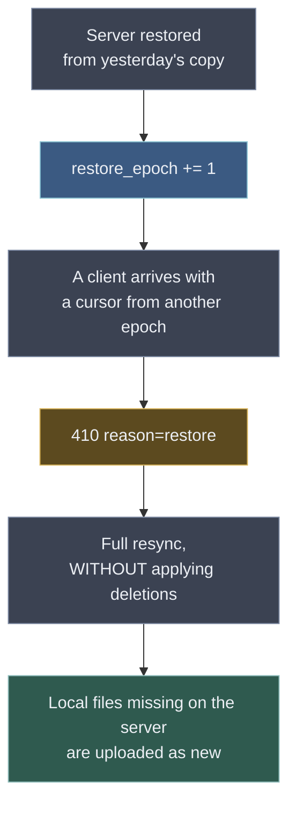

# 08 — Backup and restore

How to copy and restore the server so that recovery does not cost more than the failure did.

The subject is cross-cutting on purpose: it concerns two stores, the garbage collector, the delta cursor
and client behaviour at once. Split across those documents, the mistakes would sit on the seams.

## What is backed up

| What | Where | Without it |
|---|---|---|
| metadata | PostgreSQL | the whole tree, rights, history, accounting |
| content | blob store (filesystem or S3) | the files themselves |
| configuration | compose file, environment, TLS | access and startup |

**There are no encryption keys in the backup** — they were never on the server (E2EE always, AC-08). That is both a
strength and a limit: an administrator cannot recover the data of a user who forgot their passphrase. Nobody
can. A user who still remembers it needs no administrator — recovery ([07](07-onboarding.md)) returns the
account to a device that holds nothing at all.

## One state, not two copies

> **New writes are refused for the duration of the backup, the database is dumped first and the blobs
> are copied second, and only then is the window closed** (D-114). Both halves are normative: the window,
> and the order inside it.

Ordering the legs is not enough, and taking blobs first is the **dangerous** order. The invariant it leans
on is true ("a blob is uploaded before the node that references it") and does not say what it appears to
say: it constrains the order of two events, not their position relative to the blob snapshot. A file created
between the snapshot and the dump has its blob uploaded *after* the snapshot, so the dump references a blob
the copy does not hold. Every file created inside the backup window is exactly that case.

The failure is silent in the worst way: the restore completes, the tree is intact, the file is in it — and
it cannot be opened. Nobody finds out at restore time. Someone opens an old note months later.

A **true** freeze would remove the question: both legs would then describe the same instant and the order
between them would stop mattering. That is not what this server holds, and the difference is the whole
rule. A write that has already passed the check goes on to commit — the window turns *new* writes away,
it does not reach into the ones in flight — so the two legs describe two slightly different instants no
matter what, and only one order is safe.

> **The database is dumped first and the blobs are copied second** (D-114). That makes the blob copy a
> *superset* of what the dump references: surplus blobs are harmless and the collector removes them,
> while dangling references are neither. Blobs-first is safe only under a lock held across the whole
> dump, which is the thing the window was chosen to avoid. Written this way round because the intuitive
> order is the wrong one, and because it is what an operator improvising under pressure will reach for.
>
> `freeze` is deliberately not the word for it. That one belongs to the quota state (SH-20), and one word
> for both would make every sentence naming it ambiguous — hence `window_opened_at` / `window_closed_at`.

`backup_runs` records the window alongside both legs, and `CHECK`s reject a run with a leg outside it —
or a blob leg the database leg did not precede. An operator who dumps outside the window "just this once",
or in the intuitive order, produces a copy that restores cleanly and is missing files, and nothing about
the run would otherwise say so.

The PostgreSQL snapshot must be **transactionally consistent** (`pg_dump`, or a volume snapshot with
fsync); otherwise the invariant "node, journal and version are written together" breaks. The window does
not replace this: it makes the two *stores* agree, not the tables inside one of them.

The garbage collector must not run inside the window either, and it is not enough to schedule it elsewhere
and hope: it runs on an interval from process start, so "elsewhere" drifts. **It takes a session-scoped
advisory lock under key `0x53594E43` for the duration of a pass, and skips the pass when it cannot get
it.** So the backup takes the same lock, in one psql session held open across the whole window:

```sql
SELECT pg_advisory_lock(1398362179);   -- 0x53594E43; blocks until a pass in progress finishes
-- take the dump and copy the blobs here
SELECT pg_advisory_unlock(1398362179);
```

The blocking form matters: it waits for a pass already running, so the window is clean from the moment the
lock is granted rather than from the moment it was asked for. The same lock is what keeps two server
processes against one database from collecting at once.

> The quarantine (7 days) would cover an overlap if a run drifted, and eventually will. **It does not exist
> yet** — M0 removes an unreferenced blob on the pass that finds it, so the lock is the whole protection,
> not a second line of it.

## A restore sends the server back in time

This is the hard part, and it is not about the data — it is about the clients.



**Without an epoch the outcome is worse than "nothing arrives".** After a restore `head_rev` is lower than
the cursors clients already hold, so the same revision numbers are **reused for different content**. The
client believes it is current and diverges from the server permanently, silently.

So `server_meta.restore_epoch` is raised on every restore and travels inside the opaque cursor. A cursor
from a foreign epoch gets `410` and a full resync — the same machinery as an expired journal, with one
extra field.

**Raised, not incremented.** The epoch in the restored database is whatever it was when the copy was taken,
which may be several restores behind. `+ 1` on that value can produce an epoch the server has already
issued cursors under: those cursors then look current again, and every reason the epoch exists evaporates.
The rule is `max(state file, restored database) + 1`. The trigger only guarantees the number never goes
*down* — it cannot know that a legal-looking increase is a repeat.

There are two epochs: this one (server-wide), and `vaults.reset_epoch` (per vault) for the "my client is the source of truth" reset
(see [07](07-onboarding.md)). Distinguishing them is mandatory, because the required client behaviour is
opposite. **Both may only increase**, enforced by a trigger: a lowered epoch makes stale cursors look
current again, disabling the protection exactly when it is needed most.

> **A resync after a `restore_epoch` change does not apply deletions.** The client will see that the server lacks
> files it holds locally. The naive reading — "missing on the server means deleted remotely" — would wipe
> fresh work **on every device at once**, precisely when the user is already recovering from a failure.
>
> The rule: after a `restore_epoch` change, local files absent from the server are treated as **new local
> files** and uploaded. Whatever really was deleted before the failure, the user deletes once more —
> cheaper than the alternative.
>
> The rule is about `restore_epoch` **only**. A `vaults.reset_epoch` change is the opposite instruction and
> the resync that follows it *does* apply deletions (D-79) — that is the entire reason there are two
> counters rather than one. Never state this as "after an epoch change": that phrasing is what merges the
> two back into one.

## Backup depth and the collector

Restoring a dump older than the GC quarantine yields references to blobs the collector has already removed.
Two ways out, and the choice is deliberate — read both as describing the quarantine once it exists; until
then the effective quarantine is zero and every restore should expect the report below:

- keep the quarantine longer than the backup retention — simple, but a quarantine measured in months means
  deleted space is not reclaimed for months;
- **keep the quarantine short and verify integrity during the restore**, producing a list of lost blobs.
  Chosen: an honest report of "13 files not restored" beats a store that never frees space. **Built**
  (#155): `restore-cli.js` ends by walking every address the restored database references and naming the
  ones the restored store does not have — the same walk `verifyBackup` runs over a copy, pointed at the
  live store, where it answers the other question.

## Removing a copy, and how many to keep

Copies pile up on a schedule, so left alone they fill a disk on a schedule. Two answers, and the first is
the one that matters:

- **`BACKUP_KEEP`** — a number of finished copies to keep. Each scheduled run prunes what falls past the
  newest N, **after** taking its own: pruning first would delete an old backup to make room for one that
  then failed, which is a trade nobody would agree to if asked. Unset means keep everything, which is what
  every deployment did before this existed;
- **removing one from the console**, per row and behind a confirmation naming it. For the one-off — a run
  that left a partial copy, a copy moved by hand — not as the way to stay under a disk.

**The run stays in the history and its `destination` becomes null.** Dropping the row would leave the files
behind with nothing referencing them, which is exactly the state an operator watching free space disappear
cannot investigate. A row with no destination says what happened: this backup ran, and its copy is gone.
It is also what makes the restore rehearsal skip it, since that already asks for a destination.

**Four refusals, each a decision rather than a check.** A destination outside this deployment's backup
directory is refused, because `destination` is a text column and a value from a restored dump or another
host would otherwise become a recursive delete of whatever that path names *here*. The **newest good copy**
is refused, because it is what a restore would use and what the rehearsal verifies — a server that will not
leave itself without a backup is worth more than one that does exactly as it is told. A run still in
progress is refused, and a copy already gone is not an error.

## What backups do not replace

- **Version history is not a backup.** It lives in the same database: corruption or a mistaken `DROP`
  takes the files and their history together. The presence of `versions` creates a false sense of safety,
  which is worth remembering separately.
- **A single user cannot be restored.** Blobs are shared, and `refcount` and `user_blobs` are computed
  across the whole database. The granularity is **the whole server**; a partial restore is a manual
  operation with reference reconciliation, not a supported scenario.
- **Clients need no backup.** The vault is ordinary files on disk; a lost local plugin state is rebuilt by
  a full rescan.

## Procedure

**Backup — nightly, before the GC window:**

1. open the window: new writes are refused, record `window_opened_at`;
2. `pg_dump`;
3. snapshot the blob store;
4. close the window, record `window_closed_at` — in a `finally`, or a failed run leaves the server
   refusing writes for ever;
5. copy the configuration;
6. write an operations log entry: time, sizes, checksums.

Steps 2 and 3 are **not** interchangeable, for the reason above (D-114): a window that only refuses new
writes leaves the ones already running, and blobs-first is what turns one of those into a file that
restores and cannot be opened. Steps 1 and 4 are not optional, and a run that records neither is not a
usable copy no matter what its status column says.

**Restore:**

1. stop the service — never restore under load;
2. restore blobs, then the database;
3. **raise `restore_epoch` above every epoch that has ever been handed out.** Not `+ 1`: the restored
   database brings back an *old* epoch with it, and a blind increment can land on a value clients have
   already seen — cursors from that generation would pass validation and the protection would be off
   precisely when it is needed. The new value is
   `max(state file, restored database) + 1`, where the state file is the copy the server keeps outside
   every dump (D-92) and which therefore still holds the newest epoch the server ever ran with;
4. run the integrity check and collect the list of lost blobs;
5. start the service; clients will resync on their own;
6. tell the users — not because it is required, but because they will see a long synchronisation and should
   know why.

## Verification

> **A backup that has never been restored is not a backup.**

**The server rehearses two things, and the difference between them is the sentence above** (#159):

- at every start and on a daily interval it reopens the newest copy and confirms that every blob the
  database references is present in it. That says the copy **arrived**;
- on a much rarer interval — `REHEARSE_RESTORE_EVERY_SECONDS`, weekly by default, `0` to turn it off — it
  **loads the dump into a scratch database** created for the purpose and dropped afterwards, and confirms
  that what comes out carries this build's functions and triggers and holds at least one account. That
  says the archive can be **read**.

A `pg_dump` that fails to restore — a version mismatch, a truncated file, a corrupt archive — passes the
first and fails the second, which is the whole reason the second exists. It needs the database role to be
able to `CREATE DATABASE`; where it cannot, the server says so and carries on, because a check that
stopped the thing it checks would be the worst trade here. The outcome is written beside the restore
epoch, so *"the last successful rehearsal was 60 days ago"* survives a restart, and the console says it on
the Backups screen.

What neither can claim is that the data is **correct** — nothing outside the vaults' own keys could tell.
That is what the quarterly check below is still for.

Quarterly, by hand: restore into a separate instance and run the check —

- every `nodes.sha256` is present in the blob store;
- **every `versions.sha256` as well**;
- every blob either has a reference or is marked for collection;
- `head_rev` is not lower than the maximum journal revision, for every vault;
- every node carrying a share mark belongs to a live participant of that share, and the folder each share
  names carries that share's root item — the replication invariants, which a restore can break silently;
- `user_blobs` counters match a recount.

> **A check that skips `versions` misses exactly the loss a backup is for.** History is a separate,
> long-lived log with its own retention ([03](03-data-model.md)): a blob can be present for a node's
> current version and gone for an older one. A restore then passes verification with a damaged history, and
> it surfaces at the worst possible moment — when someone opens the version list precisely because they
> lost the current file.

The same check is the tool for the nightly reconciliation and for post-incident diagnosis. Write it once.
